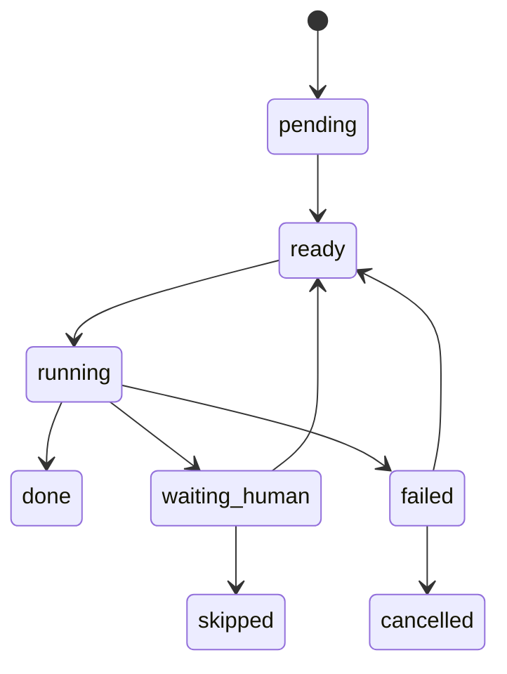
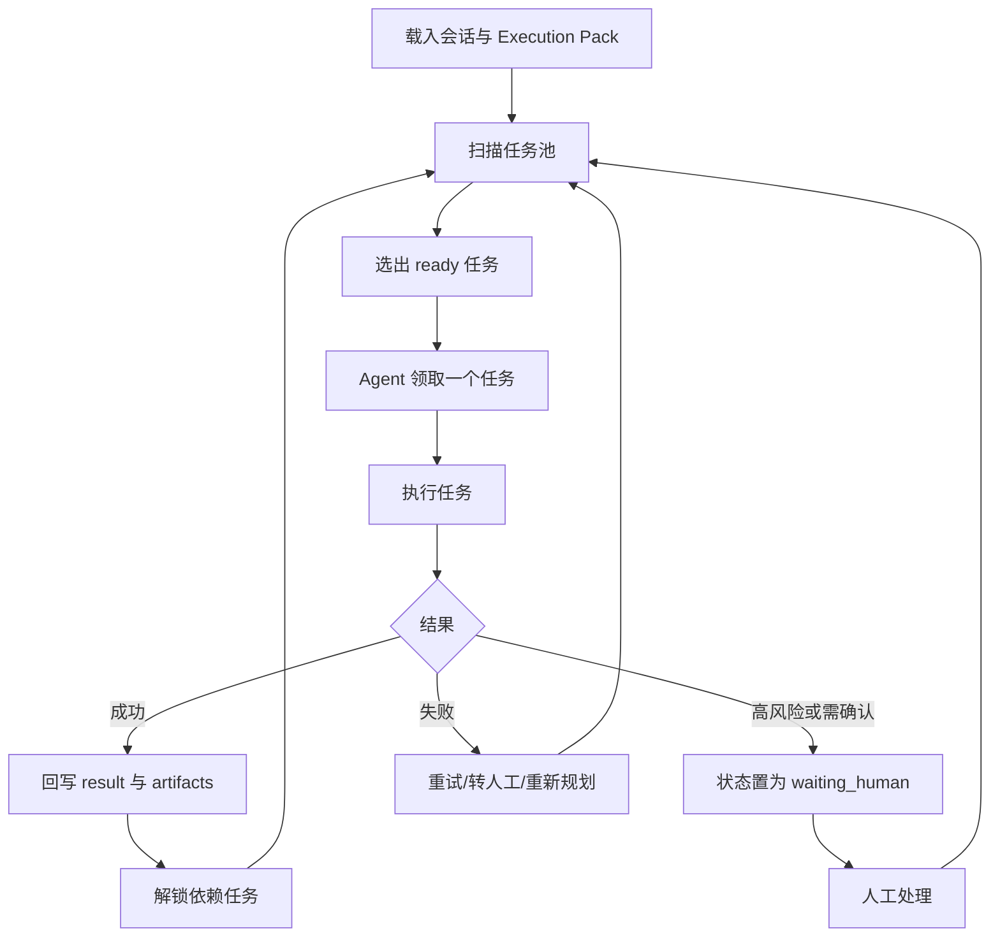
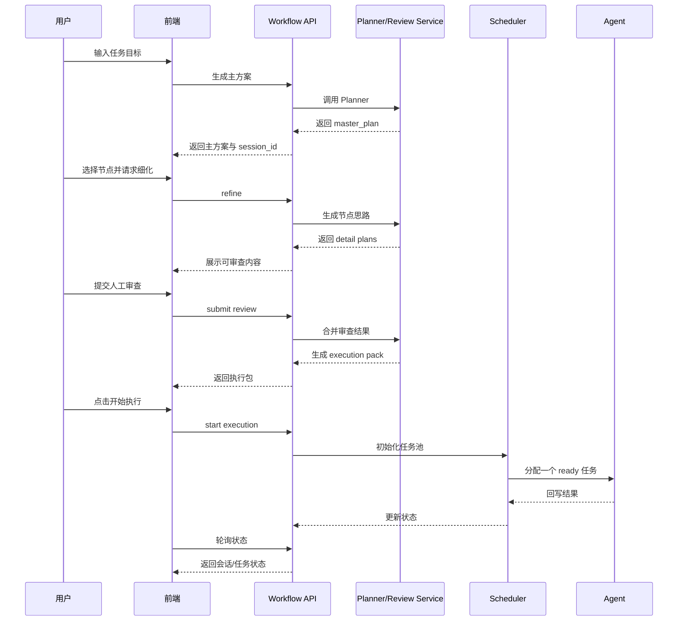
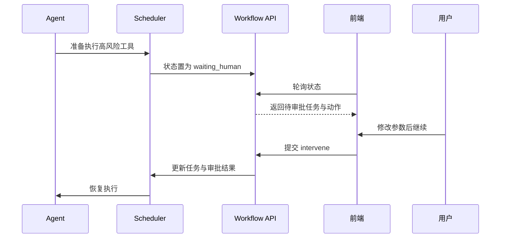

### AI 人机协同规划执行开发文档

> 已生成拆分版目录：`docs/AI人机协同规划执行/开发文档/README.md`
>
> 若需要按章节阅读、评审或继续补充，优先使用拆分版；当前文件保留为原始单文件版本。

## 一、文档目的

本文档用于把《`AI人机协同规划执行方案.md`》落成一份 **可直接进入研发阶段的项目开发文档**。

文档目标：

- **明确当前系统基线**：基于你当前 `remote-code-editor` 的前后端实现来设计，而不是脱离现有代码另起一套概念稿。
- **明确目标形态**：实现“AI 先规划、用户选重点、AI 细化、人工审查、任务池执行、运行中可介入”的协同执行系统。
- **明确研发边界**：先做可上线的 MVP，再逐步扩展为任务池化、审批化和节点化系统。
- **明确实施清单**：列出具体模块、接口、数据结构、文件改造点、状态机和开发阶段。

---

## 二、当前项目基线分析

基于当前代码，现有系统已经具备以下基础能力：

### 1. 工作流编排基础已存在
当前后端已经支持：

- 工作流图定义存储
- LangGraph 图构建
- 节点执行器注册
- 工作流运行 API
- 前端可视化编辑器

当前关键模块：

- `backend/workflow/builder.py`：将图定义构建为可执行图
- `backend/workflow/executor.py`：执行工作流图
- `backend/workflow/nodes/__init__.py`：注册节点执行器
- `frontend/src/components/workflow/WorkflowPanel.vue`：编辑器与运行面板主组件

### 2. Agent 已具备工具循环执行能力
当前 `agent_node.py` 已实现：

- 组装消息
- 调用 AI 获取 `tool_calls`
- 循环执行工具
- 把工具结果再喂回 AI
- 输出最终结果

但当前问题也很明确：

- **Agent 直接从 AI 输出进入工具执行，没有计划层**
- **没有任务池，只有连续迭代**
- **没有人工审查入口**
- **高风险工具没有前置审批**
- **失败重试、跳过、人工修正还没有结构化机制**

### 3. 运行状态展示能力已存在
当前已具备：

- `execution-state` 查询接口
- 内存态执行状态缓存
- 气泡流记录
- 前端轮询显示当前执行节点、工具、结果、AI 内容

现状优势：

- 已经有状态通道
- 已经有运行面板
- 已经有轮询机制
- 已经有前端高亮当前节点

现状不足：

- 状态只适用于“单轮执行过程展示”
- 没有承载“计划、节点思路、审查结果、任务池”的结构
- 目前主要依赖内存缓存，不适合复杂中断恢复

### 4. 前端交互承载点已存在
当前前端具备：

- 工作流编辑区
- 运行面板
- 工作流保存/加载
- 执行状态轮询
- 气泡流展示

因此本项目 **不需要从零做新页面**，而是在现有工作流面板基础上扩展：

- 协同规划区
- 节点细化区
- 人工审查区
- Execution Pack 预览区
- 任务池运行区
- 人工介入卡片

---

## 三、目标产品形态

本项目最终要实现一个 **人机协同规划执行工作台**。

### 标准流程

1. 用户输入任务目标
2. AI 生成主方案
3. 用户选中重点节点/模块
4. AI 生成这些节点的详细执行思路
5. 人工审查并修正
6. 系统生成最终 Execution Pack
7. Execution Pack 拆分为任务池
8. Agent 每次从任务池取一个小任务执行
9. 高风险或异常场景进入人工介入
10. 所有任务完成后输出最终结果

### 关键设计原则

- **先规划后执行**，不允许 Agent 一上来就自由发挥到底
- **任务池化执行**，不让 Agent 长时间连续漂移
- **人工纠偏显式化**，让用户改“计划 / 思路 / 任务”，而不是改隐式思维链
- **高风险动作可拦截**，支持执行前审批
- **状态可恢复**，执行中断后可继续

---

## 四、实施策略与技术决策

为了兼容你当前项目，建议采用 **两阶段实施策略**。

### 阶段性策略

#### Phase A：面板式 MVP
先在现有工作流系统上增加“协同规划执行模式”，不强制先做新的可视化节点类型。

特点：

- 改造成本低
- 能快速上线验证产品流程
- 主要扩展后端服务与前端运行面板
- Execution Pack 和任务池先作为业务对象存在，而不是必须先成为图节点

#### Phase B：节点化升级
在 MVP 稳定后，再把核心流程沉淀成新的工作流节点类型，例如：

- `goal_planner`
- `detail_generator`
- `human_review`
- `execution_pack_builder`
- `task_dispatcher`
- `task_agent_executor`

这样未来可以让这套能力成为工作流引擎的一部分。

### 技术决策

#### 1. 首版仍采用轮询，不立即上 WebSocket
理由：

- 当前前端已具备轮询逻辑
- 当前后端也已有状态查询接口
- 快速落地成本最低

调整建议：

- 将轮询频率从当前 `5000ms` 改为 `1000ms`
- 高优先状态下允许短轮询
- 后续 Phase 2 再升级为 WebSocket / SSE

#### 2. 状态源采用“DB 持久化 + cache 热数据”双层结构
理由：

- 当前 `cache.py` 只有内存态，不适合任务池和人工介入
- 但只用 DB 又会降低实时更新速度

方案：

- **DB 作为事实源**
- **内存 cache 作为实时镜像**
- 每个关键任务变更都落库
- 前端轮询优先走 cache 聚合态
- cache 丢失时可从 DB 重建

#### 3. 首版任务池采用串行执行
理由：

- 目前 `agent_node.py` 本身就是单循环模型
- 先把“拉取小任务 -> 执行 -> 回写 -> 审批”跑通更重要

约束：

- `max_concurrent_tasks = 1`
- 先不做并发任务调度
- 先不做多 Agent 协作执行

#### 4. 首版人工介入以高风险审批和任务纠偏为主
优先支持：

- 批准继续
- 编辑参数继续
- 修正任务约束
- 跳过任务
- 终止执行

首版暂不做：

- 多人协同审批
- 复杂任务迁移到不同执行器
- 全自动回滚

---

## 五、研发范围

### 本期要做

- 主方案生成
- 节点细化生成
- 人工审查提交
- Execution Pack 生成
- 任务池拆分
- 调度器选择任务
- Agent 按小任务执行
- 高风险任务审批
- 前端协同规划与任务池运行界面
- 运行态持久化与恢复

### 本期不做

- 多 Agent 并行任务执行
- 多人实时协同审查
- 复杂审批流（多级审批、多角色审批）
- 全量 WebSocket 推送
- 任务自动回滚脚本编排
- 完整 BPMN 级别流程设计器

---

## 六、目标架构设计

### 架构分层

#### 1. 交互层（Frontend）
负责：

- 输入任务目标
- 展示主方案树
- 选中节点/模块
- 展示节点执行思路
- 展示人工审查表单
- 展示 Execution Pack
- 展示任务池运行态
- 提供人工介入入口

#### 2. 协同规划层（Planner / Detail / Review）
负责：

- 根据任务目标生成主方案
- 根据选中节点生成详细执行思路
- 接收人工审查修改
- 合并生成最终可执行版本

#### 3. 执行编排层（Execution Pack / Task Pool / Scheduler）
负责：

- 将方案转换为 Execution Pack
- 将 Execution Pack 拆分为任务池
- 维护任务依赖、优先级和状态
- 为 Agent 选择下一个待执行任务
- 触发人工介入与重规划

#### 4. 执行层（Agent Executor）
负责：

- 每次消费一个 `ready` 任务
- 按任务约束执行工具调用
- 回写任务结果
- 标记风险与失败
- 返回下一步建议

#### 5. 状态层（DB + Cache + Bubble）
负责：

- 保存会话
- 保存主方案/节点思路/审查结果
- 保存任务池状态
- 保存人工介入记录
- 保存执行气泡流
- 支撑恢复与回放

---

## 七、核心对象设计

### 1. 协同执行会话 `ExecutionSession`
表示一次完整的人机协同执行过程。

建议字段：

- `id`
- `workflow_id`
- `goal`
- `workspace`
- `status`
- `current_phase`
- `current_task_id`
- `execution_pack_json`
- `final_result_json`
- `created_at`
- `updated_at`

推荐状态：

- `draft`
- `planning`
- `refining`
- `reviewing`
- `ready_to_execute`
- `executing`
- `waiting_human`
- `completed`
- `failed`
- `cancelled`

### 2. 主方案快照 `PlanSnapshot`
保存 AI 生成和人工修正后的主方案版本。

建议字段：

- `id`
- `session_id`
- `version`
- `source_type`（`ai` / `human_edited` / `merged`）
- `goal`
- `plan_json`
- `summary`
- `created_at`

### 3. 节点审查记录 `PlanNodeReview`
保存每个计划节点的细化思路与人工审查结果。

建议字段：

- `id`
- `session_id`
- `plan_version`
- `node_id`
- `title`
- `node_type`
- `selected`
- `detail_json`
- `review_status`
- `risk_level`
- `require_runtime_approval`
- `human_comments_json`
- `created_at`
- `updated_at`

推荐审查状态：

- `pending`
- `generated`
- `approved`
- `approved_with_changes`
- `rejected`
- `skipped`

### 4. 任务池任务 `ExecutionTask`
这是任务池的核心对象。

建议字段：

- `id`
- `session_id`
- `task_id`
- `parent_node_id`
- `title`
- `task_type`
- `status`
- `priority`
- `sequence`
- `dependencies_json`
- `inputs_json`
- `constraints_json`
- `success_criteria_json`
- `tool_hints_json`
- `assigned_executor`
- `retry_count`
- `max_retry_count`
- `requires_human_approval`
- `result_json`
- `error_message`
- `started_at`
- `finished_at`
- `created_at`
- `updated_at`

推荐任务状态：

- `pending`
- `ready`
- `running`
- `waiting_human`
- `done`
- `failed`
- `skipped`
- `cancelled`

### 5. 人工介入记录 `ExecutionIntervention`
用于记录任务级、会话级介入行为。

建议字段：

- `id`
- `session_id`
- `task_ref`
- `action`
- `status`
- `reason`
- `payload_json`
- `operator`
- `created_at`
- `resolved_at`

推荐动作类型：

- `approve`
- `edit_and_continue`
- `revise_logic`
- `skip_task`
- `requeue_task`
- `insert_task`
- `terminate`

---

## 八、数据库设计建议

### 设计原则

- 结构化字段用于可查询状态
- 大块方案与任务上下文使用 JSON 存储
- 保持与当前 `Workflow` 模型风格兼容
- 首版尽量避免过度拆表

### 推荐新增模型

#### 1. `WorkflowExecutionSession`
主会话表。

#### 2. `WorkflowPlanSnapshot`
保存主方案版本。

#### 3. `WorkflowPlanNodeReview`
保存节点细化与人工审查。

#### 4. `WorkflowExecutionTask`
保存任务池。

#### 5. `WorkflowExecutionIntervention`
保存人工介入记录。

### 是否需要单独任务事件表

#### MVP 结论
**先不单独建 `TaskEvent` 表**。

原因：

- 当前系统已经有 `bubble_records`
- 首版可复用气泡流作为时间线
- 后续若要做详细回放，再补 `TaskEvent`

---

## 九、Execution Pack 结构定义

Execution Pack 是会话进入执行阶段的正式输入。

### 推荐结构

```json
{
  "session_id": "sess-001",
  "goal": "完成用户任务",
  "workflow_id": "12",
  "workspace": "c:/Users/.../MyCodeBuddy/remote-code-editor",
  "master_plan": {
    "version": 3,
    "plan_nodes": []
  },
  "selected_nodes": ["plan-2", "plan-3"],
  "reviewed_node_plans": [],
  "global_constraints": [
    "优先复用现有实现",
    "高风险工具需人工确认"
  ],
  "execution_mode": {
    "task_execution_mode": "task_pool",
    "max_concurrent_tasks": 1,
    "require_human_approval_for": [
      "write_file",
      "execute_command",
      "delete_file"
    ]
  },
  "task_pool": {
    "selection_strategy": "topological_priority",
    "tasks": []
  },
  "scheduler": {
    "replan_on_failure": true,
    "allow_task_skip": true,
    "allow_human_requeue": true
  }
}
```

### Execution Pack 的职责边界

- 主方案负责表达整体目标与阶段
- 节点思路负责表达局部细化策略
- 任务池负责表达最小可执行单元
- 调度器负责选择下一任务
- Agent 只负责执行当前任务

---

## 十、任务池设计

### 任务粒度原则

每个任务都必须满足：

- 单一目标明确
- 输入和约束明确
- 成功条件明确
- 可独立追踪状态
- 可单独人工介入

### 推荐任务类型

- `analysis`
- `read`
- `modify`
- `verify`
- `checkpoint`
- `manual_review`
- `replan`

### 任务调度规则

首版采用：

- 按依赖关系解锁 `ready`
- 在 `ready` 中按优先级选择
- 同优先级按 `sequence` 执行
- 高风险任务先转 `waiting_human`
- 失败任务优先判断是否重试

### 任务状态流转



### 任务池调度循环



---

## 十一、后端详细设计

### 1. 模块拆分建议

在 `backend/workflow/` 下新增服务层：

- `services/planner_service.py`
- `services/detail_plan_service.py`
- `services/review_service.py`
- `services/execution_pack_service.py`
- `services/task_pool_service.py`
- `services/scheduler_service.py`
- `services/intervention_service.py`
- `services/session_state_service.py`

### 2. 现有文件改造清单

#### `backend/workflow/models.py`
新增：

- `WorkflowExecutionSession`
- `WorkflowPlanSnapshot`
- `WorkflowPlanNodeReview`
- `WorkflowExecutionTask`
- `WorkflowExecutionIntervention`

#### `backend/workflow/views.py`
新增接口：

- 主方案生成
- 节点细化
- 审查提交
- Execution Pack 构建
- 会话启动执行
- 任务列表查询
- 任务介入提交
- 会话详情查询

#### `backend/api/urls.py`
注册新的 workflow 协同执行 API。

#### `backend/workflow/cache.py`
扩展为：

- 会话热状态
- 当前任务快照
- 待处理人工命令队列
- 任务池摘要状态

#### `backend/workflow/executor.py`
扩展支持：

- 通过 `session_id` 执行协同会话
- 初始化任务池
- 驱动调度循环

#### `backend/workflow/nodes/agent_node.py`
扩展支持：

- 接收当前任务上下文而不是只接收大任务描述
- 在工具执行前执行高风险判断
- 等待人工审批
- 回写任务结果与任务状态
- 失败后支持重试建议和重规划触发

### 3. 新增内部服务职责

#### `planner_service.py`
职责：

- 根据目标生成主方案
- 输出 `plan_nodes`
- 归纳成功标准、假设、风险

#### `detail_plan_service.py`
职责：

- 根据选中节点生成详细执行思路
- 输出工具计划、回退策略、风险标记

#### `review_service.py`
职责：

- 保存人工审查意见
- 合并人工修改版本
- 判断节点是否允许进入执行阶段

#### `execution_pack_service.py`
职责：

- 聚合主方案、节点思路、人工审查结果
- 生成最终 Execution Pack

#### `task_pool_service.py`
职责：

- 将 Execution Pack 拆分为 `ExecutionTask`
- 维护依赖、优先级、约束、成功标准

#### `scheduler_service.py`
职责：

- 选择下一个 `ready` 任务
- 判断是否需要重试、跳过、重规划
- 更新任务状态与会话状态

#### `intervention_service.py`
职责：

- 接收人工指令
- 处理审批、改参、跳过、终止、插入任务
- 回写会话和任务状态

---

## 十二、后端 API 设计

### 1. 生成主方案

#### 接口
`POST /api/workflow/plan/generate/`

#### 请求体

```json
{
  "workflow_id": "12",
  "goal": "修复某模块中的配置读取逻辑",
  "workspace": "c:/Users/.../MyCodeBuddy/remote-code-editor"
}
```

#### 返回

```json
{
  "success": true,
  "session_id": "sess-001",
  "phase": "planning",
  "master_plan": {
    "goal": "修复某模块中的配置读取逻辑",
    "plan_nodes": []
  }
}
```

### 2. 生成节点细化思路

#### 接口
`POST /api/workflow/plan/refine/`

#### 请求体

```json
{
  "session_id": "sess-001",
  "selected_node_ids": ["plan-2", "plan-3"]
}
```

### 3. 提交人工审查结果

#### 接口
`POST /api/workflow/plan/review/submit/`

#### 请求体

```json
{
  "session_id": "sess-001",
  "reviews": [
    {
      "node_id": "plan-3",
      "review_status": "approved_with_changes",
      "human_comments": [
        "必须先读后写",
        "禁止直接覆盖已有文件"
      ],
      "require_runtime_approval": true
    }
  ]
}
```

### 4. 生成 Execution Pack

#### 接口
`POST /api/workflow/execution-pack/build/`

#### 请求体

```json
{
  "session_id": "sess-001"
}
```

### 5. 启动执行

#### 接口
`POST /api/workflow/executions/start/`

#### 请求体

```json
{
  "session_id": "sess-001"
}
```

#### 说明
执行开始后：

- 会话状态切为 `executing`
- 任务池初始化为 `ready/pending`
- 调度器启动
- 前端进入任务池轮询模式

### 6. 获取会话状态

#### 接口
`GET /api/workflow/executions/state/?session_id=sess-001`

#### 返回内容建议

- 会话状态
- 当前阶段
- 当前任务
- 主方案摘要
- 已审查节点摘要
- 任务池摘要
- 最新人工介入状态
- 气泡记录

### 7. 获取任务池列表

#### 接口
`GET /api/workflow/tasks/list/?session_id=sess-001`

### 8. 人工介入任务

#### 接口
`POST /api/workflow/tasks/intervene/`

#### 请求体示例

```json
{
  "session_id": "sess-001",
  "task_id": "task-002",
  "action": "edit_and_continue",
  "payload": {
    "constraints": [
      "必须先读后写",
      "写入前需再次确认目标路径"
    ]
  }
}
```

### 9. 查询会话详情

#### 接口
`GET /api/workflow/session/detail/?session_id=sess-001`

用于页面刷新恢复：

- 主方案
- 节点细化
- 审查结果
- Execution Pack
- 任务池
- 运行结果

---

## 十三、Agent 执行逻辑改造设计

### 当前问题
当前 `agent_node.py` 的模式是：

- 根据用户输入构建 messages
- 调 AI 获取工具调用
- 直接执行工具
- 再次迭代

这会导致：

- AI 缺乏计划级约束
- 工具执行前没有人工审查入口
- 无法按任务池粒度执行

### 改造目标
把 Agent 的执行模式改成：

> 输入不是“一个大任务”，而是“当前任务池中被调度出来的一个小任务 + 全局约束 + 上下文产出”。

### 推荐改造方式

#### 1. 新增任务上下文构造器
为 Agent 构造如下上下文：

- 原始总目标
- 当前任务标题
- 当前任务类型
- 当前任务输入
- 当前任务约束
- 上游任务产出
- 全局约束
- 当前允许使用的工具

#### 2. 工具执行前增加审批钩子
判断规则：

- 当前任务 `requires_human_approval = true`
- 或工具名命中高风险工具
- 或任务被人工标记为高风险

则：

- 会话状态置为 `waiting_human`
- 当前任务状态置为 `waiting_human`
- 写入待审批工具信息
- 阻塞等待人工介入结果

#### 3. 任务完成后不直接继续原循环
而是：

- 回写当前任务结果
- 标记任务 `done` / `failed`
- 让调度器决定后续任务
- 重新构造下一个任务上下文

#### 4. 失败时触发三类策略

- **自动重试**：错误可恢复
- **转人工**：高风险或重试达到上限
- **重规划**：说明原思路不适用

---

## 十四、状态缓存与恢复设计

### 当前问题
目前 `cache.py` 只存：

- 执行节点
- 执行详情
- 气泡流

不够承载：

- 会话阶段
- 当前任务
- 待审批动作
- 任务池摘要
- 人工指令队列

### 扩展建议

在 `cache.py` 中新增：

- `_execution_sessions`
- `_task_pool_snapshots`
- `_intervention_commands`
- `_human_waiting_states`

### 建议缓存结构

```json
{
  "session_id": "sess-001",
  "workflow_id": "12",
  "status": "waiting_human",
  "phase": "executing",
  "current_task": {
    "task_id": "task-002",
    "title": "修改目标实现",
    "type": "modify"
  },
  "pending_action": {
    "tool_name": "write_file",
    "arguments": {}
  },
  "task_pool_summary": {
    "done": 1,
    "running": 0,
    "waiting_human": 1,
    "pending": 2
  }
}
```

### 恢复原则

页面刷新后应通过会话详情接口恢复：

- 当前 phase
- 主方案与节点细化内容
- 已审核内容
- 当前任务状态
- 任务池列表
- 运行历史与气泡

---

## 十五、前端详细设计

### 1. 产品形态建议

基于现有 `WorkflowPanel.vue`，建议新增一个 **协同执行模式**，与当前“直接运行工作流”共存。

建议 UI 结构：

- 左侧仍保留工作流编辑器
- 右侧运行区升级为多阶段工作台

### 2. 右侧工作台建议分 5 个区块

#### 区块 A：任务目标区

字段：

- 任务目标输入框
- 工作区展示
- 生成主方案按钮

#### 区块 B：主方案区

字段：

- 主方案树
- 节点风险标签
- 节点选择勾选框
- 重新生成方案按钮

#### 区块 C：节点细化与人工审查区

字段：

- 节点执行思路卡片
- 编辑区
- 审查状态按钮
- 风险标记
- “通过 / 修改后通过 / 退回重生成 / 跳过”

#### 区块 D：Execution Pack 预览区

字段：

- 主方案摘要
- 选中节点摘要
- 人工约束摘要
- 任务池统计
- 启动执行按钮

#### 区块 E：任务池运行区

字段：

- 当前会话状态
- 当前任务
- 任务列表
- 当前任务气泡流
- 人工介入卡片

### 3. 前端新增组件建议

建议新增组件：

- `WorkflowCollabPlanPanel.vue`
- `MasterPlanTree.vue`
- `PlanNodeRefinePanel.vue`
- `HumanReviewCard.vue`
- `ExecutionPackPreview.vue`
- `TaskPoolBoard.vue`
- `TaskInterventionCard.vue`

### 4. 现有组件改造建议

#### `WorkflowPanel.vue`
改造内容：

- 增加协同规划入口
- 增加会话 `session_id` 管理
- 增加轮询协同会话状态
- 增加任务池列表和当前任务展示
- 把原 `execution-state` 轮询升级为会话态轮询

#### `WorkflowRun.vue`
改造内容：

- 增加会话阶段显示
- 增加当前任务卡片
- 增加待人工确认卡片
- 增加任务池摘要显示
- 增加审批按钮与任务操作入口

### 5. 前端数据流建议

#### 用户生成主方案

- 提交目标
- 获得 `session_id`
- 更新主方案树

#### 用户选节点生成细化

- 提交选中节点列表
- 获得细化结果
- 展示审查 UI

#### 用户完成审查后执行

- 提交审查结果
- 生成 Execution Pack
- 启动执行
- 开始轮询任务池状态

#### 运行中人工介入

- 收到 `waiting_human`
- 展示当前任务与待执行动作
- 用户操作后提交介入接口
- 状态继续推进

---

## 十六、与现有工作流系统的结合方式

### MVP 方案

#### 方案结论
**先不强制把“协同规划执行”拆成新的图节点**，而是先做成当前工作流系统上的“高级执行模式”。

理由：

- 当前图引擎已经可执行，但还不适合直接承接复杂审查中断逻辑
- 如果一开始就做全节点化，开发周期会显著拉长
- 先用业务服务 + 前端工作台把流程打通更现实

### V2 节点化升级方案

当 MVP 稳定后，可以再新增以下节点类型：

- `goal_planner`
- `node_selector`
- `detail_generator`
- `human_review`
- `execution_pack_builder`
- `task_dispatcher`
- `task_executor`

届时改造点包括：

- `backend/workflow/nodes/__init__.py` 注册新节点
- `builder.py` 支持新节点类型
- 前端节点库新增对应节点

---

## 十七、接口与状态时序

### 主流程时序



### 运行中人工介入时序



---

## 十八、开发阶段拆解

### Phase 1：数据层与后端能力

目标：先把会话、方案、任务池、人工介入的数据与 API 打通。

任务：

- 新增模型与迁移
- 新增协同执行 API
- 扩展 `cache.py`
- 增加 planner/detail/review/task_pool/scheduler 服务
- 完成 Execution Pack 生成与任务池初始化

交付结果：

- 能通过接口生成主方案
- 能细化节点
- 能提交审查
- 能产出任务池

### Phase 2：前端协同规划工作台

目标：让用户可以完整走通规划、细化、审查、生成执行包。

任务：

- `WorkflowPanel.vue` 增加协同执行模式
- 新增主方案树组件
- 新增节点细化与审查组件
- 新增 Execution Pack 预览组件
- 完成会话详情恢复逻辑

交付结果：

- 用户可以在前端走完“生成方案 -> 选节点 -> 审查 -> 生成执行包”

### Phase 3：任务池执行与人工介入

目标：打通真正的任务池执行循环。

任务：

- 调度器按 `ready` 选择任务
- Agent 执行单任务
- 任务结果回写
- 高风险工具审批
- 前端任务池板和人工介入卡片

交付结果：

- Agent 不再直接跑大任务，而是按小任务执行
- 用户可在运行中审批或修正

### Phase 4：稳定化与恢复

目标：让系统更可靠，适合真实使用。

任务：

- 页面刷新恢复
- 任务失败恢复
- 审计日志补全
- 轮询优化
- 任务池统计与搜索

交付结果：

- 会话可恢复
- 任务状态可追踪
- 人工介入有审计记录

---

## 十九、验收标准

### MVP 验收标准

必须满足：

- 用户可输入任务目标并生成主方案
- 用户可选择节点并生成节点细化思路
- 用户可提交人工审查结果
- 系统可生成 Execution Pack
- 系统可将执行包拆成任务池
- Agent 可按小任务顺序执行
- 命中高风险工具时可暂停等待人工确认
- 用户可审批 / 改参 / 跳过 / 终止
- 执行结果与气泡流可查看
- 页面刷新后能恢复当前会话信息

### 稳定性验收标准

- 任务状态不乱跳
- 执行中断后不会整包丢失
- 审查结果不会因为页面刷新丢失
- 至少支持 `write_file / execute_command / delete_file` 三类高风险工具审批

---

## 二十、测试方案

### 1. 单元测试

覆盖：

- Planner 输出结构校验
- 节点细化输出结构校验
- Review 合并逻辑
- Execution Pack 构建逻辑
- 任务池拆分逻辑
- 调度器选择逻辑
- 任务状态流转逻辑

### 2. 接口测试

覆盖：

- 主方案生成接口
- 节点细化接口
- 审查提交接口
- 执行包构建接口
- 执行启动接口
- 任务介入接口
- 会话详情接口

### 3. 前端联调测试

覆盖：

- 方案树显示
- 节点选择与细化
- 审查提交
- 启动执行
- 任务池显示
- 人工审批交互
- 页面刷新恢复

### 4. 场景测试

重点测试场景：

- 正常执行完整任务
- 高风险工具触发审批
- 工具执行失败后转人工
- 用户跳过任务
- 用户中途终止
- 页面刷新后恢复会话

---

## 二十一、风险与应对

### 风险 1：当前执行链路偏同步，不适合长等待

#### 应对
MVP 先允许短时间等待人工介入，后续再演进为后台任务 + WebSocket。

### 风险 2：仅靠内存缓存会丢状态

#### 应对
关键状态必须落库，cache 仅做热态。

### 风险 3：一开始节点化会拖慢整体开发

#### 应对
先做面板式 MVP，后做节点化升级。

### 风险 4：任务池拆分过细会增加交互负担

#### 应对
MVP 任务粒度控制在“用户能理解、Agent 能独立完成”的级别，不做过细拆分。

### 风险 5：Agent 仍可能在单任务内部漂移

#### 应对
给任务增加严格约束、工具白名单、成功标准和高风险审批。

---

## 二十二、推荐首版开发顺序

如果只按最小成本做出一版能用的，建议按下面顺序：

### 第 1 周

- 建模型
- 建会话 API
- 建主方案与节点细化 API

### 第 2 周

- 建审查与 Execution Pack 生成
- 建任务池初始化逻辑
- 前端做主方案和审查 UI

### 第 3 周

- 改造 `agent_node.py` 支持任务上下文
- 做调度器
- 做高风险人工介入

### 第 4 周

- 做运行面板任务池 UI
- 做刷新恢复
- 做测试与修 bug

---

## 二十三、结论

本开发文档的核心结论是：

- 当前项目已经有工作流、Agent、运行态和前端面板基础
- 最合理的实现方式不是重写整套工作流系统，而是 **在现有系统上新增一层协同规划 + 任务池调度 + 人工介入能力**
- 首版应优先做 **面板式协同执行模式**，先验证产品闭环
- 当闭环稳定后，再把能力沉淀为新的工作流节点类型

最终，系统会从：

> AI 直接根据大任务循环调用工具

升级为：

> AI 先生成方案，人选择重点，AI 细化，人审查修正，系统生成任务池，Agent 每次只执行一个被调度的小任务，必要时等待人工纠偏。

这才是适合你当前项目架构、又能真正提升可靠性的落地方向。

---

## 二十四、接口详细字段文档

本节用于把第十二章中的接口定义补充到 **可直接联调** 的粒度。

### 统一约定

#### 1. Base URL
- 默认前缀：`/api/workflow/`
- 示例中使用 `sess-001` 仅表达语义，**MVP 实际返回值可直接使用字符串化的数据库主键**。

#### 2. 内容类型
- `POST` 接口统一使用 `Content-Type: application/json`
- `GET` 接口通过 query string 传参

#### 3. 统一返回结构

##### 成功返回
```json
{
  "success": true,
  "session_id": "123",
  "phase": "planning"
}
```

##### 失败返回
```json
{
  "error": "缺少 session_id"
}
```

#### 4. 通用错误码约定

| HTTP 状态码 | 错误标识 | 含义 | 典型触发场景 |
| --- | --- | --- | --- |
| `400` | `invalid_json` | 请求体不是合法 JSON | body 解析失败 |
| `400` | `missing_field` | 缺少必填字段 | `goal` / `session_id` 缺失 |
| `400` | `invalid_field` | 字段格式错误或值非法 | `selected_node_ids` 不是数组 |
| `404` | `workflow_not_found` | 工作流不存在 | `workflow_id` 无效 |
| `404` | `session_not_found` | 会话不存在 | `session_id` 无效 |
| `404` | `task_not_found` | 任务不存在 | `task_id` 不存在 |
| `409` | `invalid_phase_transition` | 当前阶段不允许该操作 | 未审查先构建执行包 |
| `422` | `review_incomplete` | 审查信息不足 | 关键节点未审查 |
| `500` | `internal_error` | 服务内部异常 | 序列化、调度、AI 服务异常 |

> MVP 当前实现中，错误响应主体主要返回 `error` 字段；后续建议补上 `code / message / detail` 三段式结构。

---

### 1. 生成主方案

#### 接口
`POST /api/workflow/plan/generate/`

#### 请求字段

| 字段 | 类型 | 必填 | 说明 | 校验规则 |
| --- | --- | --- | --- | --- |
| `workflow_id` | `string` | 否 | 关联已有工作流 ID | 若传入则必须能查到对应工作流 |
| `goal` | `string` | 是 | 用户任务目标 | 去首尾空格后不能为空，建议 `1~5000` 字符 |
| `workspace` | `string` | 否 | 工作区绝对路径 | 可为空；建议为前端当前打开工作区 |

#### 请求示例
```json
{
  "workflow_id": "12",
  "goal": "修复某模块中的配置读取逻辑",
  "workspace": "c:/Users/.../MyCodeBuddy/remote-code-editor"
}
```

#### 成功返回字段

| 字段 | 类型 | 说明 |
| --- | --- | --- |
| `success` | `boolean` | 是否成功 |
| `session_id` | `string` | 新建会话 ID |
| `phase` | `string` | 当前阶段，初始为 `planning` |
| `master_plan` | `object` | 主方案对象 |
| `master_plan.goal` | `string` | 任务目标 |
| `master_plan.workflow_id` | `string \| null` | 关联工作流 |
| `master_plan.success_criteria` | `string[]` | 成功标准 |
| `master_plan.assumptions` | `string[]` | 假设条件 |
| `master_plan.risks` | `string[]` | 风险列表 |
| `master_plan.plan_nodes` | `object[]` | 主方案节点 |

#### 节点字段说明

| 字段 | 类型 | 说明 |
| --- | --- | --- |
| `id` | `string` | 节点 ID，如 `plan-1` |
| `title` | `string` | 节点标题 |
| `type` | `string` | 节点类型，建议取值 `analysis/read/modify/checkpoint` |
| `description` | `string` | 节点说明 |
| `depends_on` | `string[]` | 依赖的上游节点 ID |

#### 错误场景
- `400 missing_field`：未传 `goal`
- `404 workflow_not_found`：`workflow_id` 找不到
- `500 internal_error`：Planner 生成异常

---

### 2. 生成节点细化思路

#### 接口
`POST /api/workflow/plan/refine/`

#### 请求字段

| 字段 | 类型 | 必填 | 说明 | 校验规则 |
| --- | --- | --- | --- | --- |
| `session_id` | `string` | 是 | 会话 ID | 必须存在 |
| `selected_node_ids` | `string[]` | 是 | 需要细化的节点 ID 列表 | 至少 1 个；每个节点必须存在于主方案中 |

#### 返回字段

| 字段 | 类型 | 说明 |
| --- | --- | --- |
| `success` | `boolean` | 是否成功 |
| `session_id` | `string` | 会话 ID |
| `phase` | `string` | `refining` |
| `refined_nodes` | `object[]` | 节点细化结果 |

#### `refined_nodes[*]` 字段

| 字段 | 类型 | 说明 |
| --- | --- | --- |
| `node_id` | `string` | 节点 ID |
| `title` | `string` | 节点标题 |
| `steps` | `string[]` | 细化步骤列表 |
| `tool_plan` | `string[]` | 建议工具计划 |
| `constraints` | `string[]` | 执行约束 |
| `fallback` | `string` | 回退策略 |
| `risk_flags` | `string[]` | 风险标记 |
| `require_runtime_approval` | `boolean` | 是否运行期审批 |

#### 错误场景
- `400 missing_field`：缺少 `session_id`
- `400 invalid_field`：`selected_node_ids` 为空或不是数组
- `404 session_not_found`：会话不存在
- `409 invalid_phase_transition`：当前会话已终止或已执行完毕，禁止重复细化

---

### 3. 提交人工审查结果

#### 接口
`POST /api/workflow/plan/review/submit/`

#### 请求字段

| 字段 | 类型 | 必填 | 说明 | 校验规则 |
| --- | --- | --- | --- | --- |
| `session_id` | `string` | 是 | 会话 ID | 必须存在 |
| `reviews` | `object[]` | 是 | 审查结果列表 | 至少 1 条 |

#### `reviews[*]` 字段

| 字段 | 类型 | 必填 | 说明 | 校验规则 |
| --- | --- | --- | --- | --- |
| `node_id` | `string` | 是 | 节点 ID | 不能为空 |
| `node_title` | `string` | 否 | 节点标题 | 可选，前端可回传显示用标题 |
| `detail_plan` | `object` | 否 | 原始细化方案 | 未传时保留已有值 |
| `review_status` | `string` | 是 | 审查状态 | `pending/approved/approved_with_changes/rejected/skipped` |
| `human_comments` | `string[]` | 否 | 人工备注 | 建议每项长度 `<= 500` |
| `reviewed_detail_plan` | `object` | 否 | 人工编辑后的方案 | 若 `approved_with_changes` 建议必填 |
| `require_runtime_approval` | `boolean` | 否 | 是否要求运行中审批 | 默认 `false` |

#### 返回字段

| 字段 | 类型 | 说明 |
| --- | --- | --- |
| `success` | `boolean` | 是否成功 |
| `session_id` | `string` | 会话 ID |
| `phase` | `string` | `reviewed` |
| `status` | `string` | `ready_for_pack` |
| `review_count` | `number` | 落库成功的审查条数 |

#### 错误场景
- `400 missing_field`：缺少 `session_id`
- `400 invalid_field`：`review_status` 非法
- `404 session_not_found`：会话不存在
- `422 review_incomplete`：关键节点未审查但尝试进入执行阶段

---

### 4. 生成 Execution Pack

#### 接口
`POST /api/workflow/execution-pack/build/`

#### 请求字段

| 字段 | 类型 | 必填 | 说明 |
| --- | --- | --- | --- |
| `session_id` | `string` | 是 | 会话 ID |

#### 返回字段

| 字段 | 类型 | 说明 |
| --- | --- | --- |
| `success` | `boolean` | 是否成功 |
| `session_id` | `string` | 会话 ID |
| `phase` | `string` | `packed` |
| `status` | `string` | `ready_to_execute` |
| `execution_pack` | `object` | 最终执行包 |

#### `execution_pack` 关键字段

| 字段 | 类型 | 说明 |
| --- | --- | --- |
| `session_id` | `string` | 会话 ID |
| `goal` | `string` | 总目标 |
| `master_plan` | `object` | 主方案 |
| `reviewed_nodes` | `object[]` | 已审查节点方案 |
| `global_constraints` | `string[]` | 全局约束 |
| `task_pool` | `object[] \| object` | 任务池初始结构 |
| `version` | `number` | 执行包版本 |

#### 错误场景
- `400 missing_field`：缺少 `session_id`
- `404 session_not_found`：会话不存在
- `409 invalid_phase_transition`：未完成主方案与审查流程
- `422 review_incomplete`：审查信息不足

---

### 5. 启动执行

#### 接口
`POST /api/workflow/executions/start/`

#### 请求字段

| 字段 | 类型 | 必填 | 说明 |
| --- | --- | --- | --- |
| `session_id` | `string` | 是 | 会话 ID |

#### 返回字段

| 字段 | 类型 | 说明 |
| --- | --- | --- |
| `success` | `boolean` | 是否成功 |
| `session_id` | `string` | 会话 ID |
| `phase` | `string` | `executing` |
| `status` | `string` | `executing` |
| `task_count` | `number` | 初始化后的任务数 |
| `state` | `object` | 当前会话摘要状态 |

#### `state` 字段

| 字段 | 类型 | 说明 |
| --- | --- | --- |
| `session_id` | `string` | 会话 ID |
| `workflow_id` | `string \| null` | 关联工作流 |
| `goal` | `string` | 总目标 |
| `status` | `string` | 会话状态 |
| `phase` | `string` | 当前阶段 |
| `task_pool_summary` | `object` | 任务统计 |
| `next_task_id` | `string \| null` | 下一待执行任务 |
| `updated_at` | `string` | 更新时间 |

#### 错误场景
- `400 missing_field`：缺少 `session_id`
- `404 session_not_found`：会话不存在
- `409 invalid_phase_transition`：会话已终止或已在执行中
- `500 internal_error`：任务池初始化失败

---

### 6. 获取会话状态

#### 接口
`GET /api/workflow/executions/state/?session_id=sess-001`

#### Query 参数

| 参数 | 类型 | 必填 | 说明 |
| --- | --- | --- | --- |
| `session_id` | `string` | 是 | 会话 ID |

#### 返回字段

| 字段 | 类型 | 说明 |
| --- | --- | --- |
| `success` | `boolean` | 是否成功 |
| `state` | `object` | 会话聚合状态 |

#### `task_pool_summary` 子字段

| 字段 | 类型 | 说明 |
| --- | --- | --- |
| `total` | `number` | 总任务数 |
| `pending` | `number` | 待解锁任务数 |
| `ready` | `number` | 可执行任务数 |
| `running` | `number` | 执行中任务数 |
| `waiting_human` | `number` | 等待人工处理任务数 |
| `done` | `number` | 已完成任务数 |
| `failed` | `number` | 失败任务数 |
| `skipped` | `number` | 已跳过任务数 |

#### 错误场景
- `400 missing_field`
- `404 session_not_found`

---

### 7. 获取任务池列表

#### 接口
`GET /api/workflow/tasks/list/?session_id=sess-001`

#### 返回字段

| 字段 | 类型 | 说明 |
| --- | --- | --- |
| `success` | `boolean` | 是否成功 |
| `session_id` | `string` | 会话 ID |
| `tasks` | `object[]` | 任务列表 |

#### `tasks[*]` 字段

| 字段 | 类型 | 说明 |
| --- | --- | --- |
| `task_id` | `string` | 任务 ID |
| `title` | `string` | 标题 |
| `description` | `string` | 描述 |
| `task_type` | `string` | 任务类型 |
| `status` | `string` | 当前状态 |
| `priority` | `number` | 优先级 |
| `dependencies` | `string[]` | 依赖任务 |
| `constraints` | `string[]` | 执行约束 |
| `requires_human_approval` | `boolean` | 是否需审批 |
| `is_high_risk` | `boolean` | 是否高风险 |
| `result_summary` | `string` | 执行结果摘要 |
| `retry_count` | `number` | 当前重试次数 |
| `max_retries` | `number` | 最大重试次数 |
| `artifacts` | `object` | 产出物 |
| `updated_at` | `string` | 更新时间 |

---

### 8. 人工介入任务

#### 接口
`POST /api/workflow/tasks/intervene/`

#### 请求字段

| 字段 | 类型 | 必填 | 说明 | 校验规则 |
| --- | --- | --- | --- | --- |
| `session_id` | `string` | 是 | 会话 ID | 必须存在 |
| `task_id` | `string` | 否 | 任务 ID | 会话级终止可不传 |
| `action` | `string` | 是 | 操作动作 | `continue/edit_and_continue/skip/retry/terminate` |
| `payload` | `object` | 否 | 动作参数 | 不同动作字段不同 |

#### `payload` 推荐字段

| 场景 | 字段 | 类型 | 说明 |
| --- | --- | --- | --- |
| `edit_and_continue` | `constraints` | `string[]` | 新执行约束 |
| `skip` | `reason` | `string` | 跳过原因 |
| `retry` | `reason` | `string` | 重试说明 |
| `terminate` | `reason` | `string` | 终止原因 |

#### 返回字段

| 字段 | 类型 | 说明 |
| --- | --- | --- |
| `success` | `boolean` | 是否成功 |
| `session_id` | `string` | 会话 ID |
| `intervention_id` | `number` | 介入记录 ID |
| `state` | `object` | 更新后的聚合状态 |

#### 错误场景
- `400 missing_field`：缺少 `session_id` 或 `action`
- `404 session_not_found`
- `404 task_not_found`
- `409 invalid_phase_transition`：任务已完成，不能重复介入

---

### 9. 查询会话详情

#### 接口
`GET /api/workflow/session/detail/?session_id=sess-001`

#### 返回字段

| 字段 | 类型 | 说明 |
| --- | --- | --- |
| `success` | `boolean` | 是否成功 |
| `session` | `object` | 会话主信息 |
| `reviews` | `object[]` | 节点审查详情 |
| `tasks` | `object[]` | 任务池完整列表 |
| `state` | `object` | 聚合状态 |

#### `session` 字段

| 字段 | 类型 | 说明 |
| --- | --- | --- |
| `session_id` | `string` | 会话 ID |
| `workflow_id` | `string \| null` | 关联工作流 |
| `goal` | `string` | 总目标 |
| `workspace` | `string` | 工作区路径 |
| `phase` | `string` | 当前阶段 |
| `status` | `string` | 当前状态 |
| `master_plan` | `object` | 主方案 |
| `execution_pack` | `object` | 执行包 |
| `latest_error` | `string` | 最近错误 |
| `updated_at` | `string` | 更新时间 |
| `created_at` | `string` | 创建时间 |

#### 刷新恢复必用字段
- `session.phase`
- `session.master_plan`
- `reviews`
- `tasks`
- `state.task_pool_summary`

---

## 二十五、数据库表结构文档

### 1. 设计落地说明

原设计里建议使用 JSON 存储大块结构化数据；但结合你当前环境，**MVP 实际采用 `TextField + JSON 序列化/反序列化方法`**，原因是当前 SQLite 环境对 `JSONField` 支持存在限制。

因此落地策略为：
- **状态字段、标识字段、关系字段**：使用常规 Django 字段，便于查询与过滤
- **大块结构数据**：使用 `TextField`
- **读写入口统一封装**：通过 `get_xxx()` / `set_xxx()` 保持上层调用体验一致

---

### 2. 表结构总览

| 模型 | 表名 | 用途 |
| --- | --- | --- |
| `WorkflowExecutionSession` | `ai_workflow_execution_session` | 协同执行主会话 |
| `WorkflowPlanSnapshot` | `ai_workflow_plan_snapshot` | 主方案快照历史 |
| `WorkflowPlanNodeReview` | `ai_workflow_plan_node_review` | 节点细化与审查 |
| `WorkflowExecutionTask` | `ai_workflow_execution_task` | 任务池任务 |
| `WorkflowExecutionIntervention` | `ai_workflow_execution_intervention` | 人工介入记录 |

---

### 3. `WorkflowExecutionSession`

#### 作用
表示一次完整的“规划 → 审查 → 执行”会话。

#### 字段定义

| 字段 | Django 类型 | 必填 | 默认值 | 说明 |
| --- | --- | --- | --- | --- |
| `id` | `BigAutoField` | 是 | 自增 | 主键 |
| `workflow` | `ForeignKey(Workflow)` | 否 | `null` | 关联已有工作流 |
| `goal` | `TextField` | 是 | 无 | 用户总目标 |
| `workspace` | `CharField(1024)` | 否 | `''` | 工作区路径 |
| `phase` | `CharField(32)` | 是 | `planning` | 当前阶段 |
| `status` | `CharField(32)` | 是 | `draft` | 会话状态 |
| `master_plan` | `TextField` | 是 | `'{}'` | 主方案 JSON 串 |
| `execution_pack` | `TextField` | 是 | `'{}'` | 执行包 JSON 串 |
| `metadata` | `TextField` | 是 | `'{}'` | 扩展字段 |
| `latest_error` | `TextField` | 否 | `''` | 最近错误 |
| `created_at` | `DateTimeField` | 是 | 自动 | 创建时间 |
| `updated_at` | `DateTimeField` | 是 | 自动 | 更新时间 |

#### 推荐状态取值
- `phase`：`planning / refining / reviewed / packed / executing / terminated / finished`
- `status`：`draft / ready_for_pack / ready_to_execute / executing / waiting_human / failed / terminated / completed`

#### 查询场景
- 按 `workflow_id` 查询历史会话
- 按 `status` 查询执行中会话
- 按 `updated_at` 查询最近活跃会话

---

### 4. `WorkflowPlanSnapshot`

#### 作用
保存主方案版本历史，便于回放和比较。

#### 字段定义

| 字段 | Django 类型 | 说明 |
| --- | --- | --- |
| `id` | `BigAutoField` | 主键 |
| `session` | `ForeignKey(WorkflowExecutionSession)` | 所属会话 |
| `source` | `CharField(32)` | 来源，如 `ai/human/system` |
| `version` | `PositiveIntegerField` | 版本号 |
| `content` | `TextField` | 主方案 JSON 串 |
| `created_at` | `DateTimeField` | 创建时间 |

#### 使用建议
- 每次重新生成主方案时新增快照，不覆盖旧数据
- 若支持人工修改主方案，也应追加快照

---

### 5. `WorkflowPlanNodeReview`

#### 作用
保存节点细化内容和人工审查结果。

#### 字段定义

| 字段 | Django 类型 | 说明 |
| --- | --- | --- |
| `session` | `ForeignKey` | 所属会话 |
| `node_id` | `CharField(128)` | 节点 ID |
| `node_title` | `CharField(256)` | 节点标题 |
| `detail_plan` | `TextField` | AI 细化方案 JSON 串 |
| `review_status` | `CharField(32)` | 审查状态 |
| `human_comments` | `TextField` | 人工备注 JSON 串 |
| `reviewed_detail_plan` | `TextField` | 人工修订方案 JSON 串 |
| `require_runtime_approval` | `BooleanField` | 是否运行时审批 |
| `updated_at` | `DateTimeField` | 更新时间 |
| `created_at` | `DateTimeField` | 创建时间 |

#### 唯一约束
- `uniq_session_node_review(session, node_id)`

#### 推荐状态
- `pending`
- `approved`
- `approved_with_changes`
- `rejected`
- `skipped`

---

### 6. `WorkflowExecutionTask`

#### 作用
表示任务池中的最小执行单元。

#### 字段定义

| 字段 | Django 类型 | 说明 |
| --- | --- | --- |
| `session` | `ForeignKey` | 所属会话 |
| `task_id` | `CharField(128)` | 业务任务 ID，如 `task-001` |
| `title` | `CharField(256)` | 标题 |
| `description` | `TextField` | 描述 |
| `task_type` | `CharField(32)` | 任务类型 |
| `status` | `CharField(32)` | 任务状态 |
| `priority` | `IntegerField` | 优先级，值越小越优先 |
| `dependencies` | `TextField` | 依赖任务列表 JSON 串 |
| `constraints` | `TextField` | 执行约束 JSON 串 |
| `artifacts` | `TextField` | 执行产出 JSON 串 |
| `result_summary` | `TextField` | 执行结果摘要 |
| `retry_count` | `PositiveIntegerField` | 当前重试次数 |
| `max_retries` | `PositiveIntegerField` | 最大重试次数 |
| `requires_human_approval` | `BooleanField` | 是否需人工审批 |
| `is_high_risk` | `BooleanField` | 是否高风险 |
| `created_at` | `DateTimeField` | 创建时间 |
| `updated_at` | `DateTimeField` | 更新时间 |

#### 唯一约束
- `uniq_session_task(session, task_id)`

#### 推荐状态
- `pending`
- `ready`
- `running`
- `waiting_human`
- `done`
- `failed`
- `skipped`
- `cancelled`

---

### 7. `WorkflowExecutionIntervention`

#### 作用
记录运行期人工决策。

#### 字段定义

| 字段 | Django 类型 | 说明 |
| --- | --- | --- |
| `session` | `ForeignKey` | 所属会话 |
| `task` | `ForeignKey` | 可为空；用于会话级动作 |
| `action` | `CharField(64)` | 动作类型 |
| `payload` | `TextField` | 动作参数 JSON 串 |
| `operator` | `CharField(64)` | 操作人 |
| `note` | `TextField` | 备注 |
| `created_at` | `DateTimeField` | 创建时间 |

#### 推荐动作类型
- `continue`
- `edit_and_continue`
- `skip`
- `retry`
- `terminate`
- `insert_task`
- `requeue`

---

### 8. 迁移方案细化

#### 当前迁移文件
- `workflow/migrations/0006_workflowexecutionsession_workflowplansnapshot_and_more.py`

#### 本次迁移内容
- 新增 5 张协同执行相关表
- 新增 2 个唯一约束
- 保持与现有 `Workflow` 表解耦，采用增量扩展方式

#### 为什么不直接使用 `JSONField`
- 当前开发环境为 SQLite
- 直接使用 `JSONField` 会触发兼容性问题
- 首版目标是先确保 **本地开发、联调、演示环境** 可稳定落地

#### 后续升级到 PostgreSQL 的建议
1. 保留当前业务接口不变
2. 新增平滑迁移脚本，把 `TextField` JSON 串迁移为原生 `JSONB`
3. 对高频筛选字段建立索引，如 `status / phase / session_id`
4. 对 `artifacts`、`execution_pack` 中的关键路径按需做表达式索引

#### 推荐后续索引
- `WorkflowExecutionSession(status, updated_at)`
- `WorkflowExecutionTask(session_id, status, priority)`
- `WorkflowExecutionIntervention(session_id, created_at)`

---

## 二十六、前端页面交互文档

### 1. 页面总目标

协同执行工作台的目标不是只展示数据，而是支撑用户完成下面闭环：

1. 输入目标
2. 生成主方案
3. 选择关键节点
4. 生成局部细化
5. 审查并修正
6. 生成执行包
7. 启动执行
8. 运行中持续观察与介入

---

### 2. 页面级状态机

#### 页面模式
- `idle`：初始状态，尚未开始会话
- `planning`：正在生成主方案
- `refining`：正在生成节点细化
- `reviewing`：用户审查中
- `pack_ready`：可生成执行包
- `executing`：任务池执行中
- `waiting_human`：等待人工介入
- `finished`：执行完成
- `terminated`：已终止
- `error`：接口或运行错误

#### 页面恢复原则
- 若存在 `session_id`，页面加载时优先调用 `session/detail`
- 若会话处于 `executing / waiting_human`，立即启动状态轮询
- 若会话处于 `planning / refining / reviewed / packed`，恢复编辑态，不自动重跑

---

### 3. 区块 A：任务目标区

#### 显示内容
- 任务目标输入框
- 当前工作区路径
- 生成主方案按钮
- 重置会话按钮
- 最近错误提示条

#### 按钮逻辑

##### `生成主方案`
- **可点击条件**：`goal.trim().length > 0` 且当前不在请求中
- **点击后行为**：
  - 禁用输入框与按钮
  - 调用 `plan/generate`
  - 成功后写入 `session_id` 与 `master_plan`
  - 切换页面状态为 `planning_done`

##### `重置会话`
- **可点击条件**：存在当前会话
- **点击后行为**：
  - 弹二次确认
  - 清空 `session_id`
  - 清空主方案/审查/任务池本地状态
  - 停止轮询

#### 异常显示
- `goal` 为空：按钮置灰，提示“请输入任务目标”
- 接口失败：区域顶部显示错误提示条，不清空已输入内容

---

### 4. 区块 B：主方案区

#### 显示内容
- 主方案摘要
- `plan_nodes` 树状列表
- 每个节点的类型、风险标签、依赖关系
- 节点勾选框
- 重新生成方案按钮
- 生成节点细化按钮

#### 节点显示逻辑
- 默认展开一级节点
- 被选中节点高亮
- 高风险节点显示红色 `高风险` 标签
- 已生成细化的节点显示 `已细化`
- 已审查节点显示 `已审查`

#### 按钮逻辑

##### `重新生成方案`
- 清空当前选中节点、细化结果、审查状态、执行包
- 保留目标输入框内容
- 再次请求 `plan/generate`

##### `生成节点细化`
- **可点击条件**：至少勾选一个节点
- **点击后行为**：
  - 调用 `plan/refine`
  - 成功后切换到区块 C 的审查态

#### 空态文案
- 无主方案：`请先在上方输入任务目标并生成主方案`

---

### 5. 区块 C：节点细化与人工审查区

#### 显示内容
- 节点细化卡片列表
- 每个节点的 `steps / tool_plan / constraints / fallback / risk_flags`
- 可编辑备注区
- 审查动作按钮

#### 每张卡片上的动作按钮
- `通过`
- `修改后通过`
- `退回重生成`
- `跳过`
- `标记运行时审批`

#### 按钮行为定义

##### `通过`
- 写入 `review_status = approved`
- 默认保留原始 `detail_plan`

##### `修改后通过`
- 打开编辑器
- 允许修改：步骤、工具计划、约束、回退策略
- 保存后写入 `review_status = approved_with_changes`
- 同时写入 `reviewed_detail_plan`

##### `退回重生成`
- 当前卡片状态置为 `rejected`
- 可选择立即再次调 `plan/refine`，也可仅标记待处理

##### `跳过`
- 状态置为 `skipped`
- 前端在 Execution Pack 预览中标记为不进入执行池

##### `标记运行时审批`
- 切换 `require_runtime_approval = true`
- 用于即使工具本身不高风险，也要求运行中停下来确认

#### 区块级按钮
- `提交全部审查结果`
- **可点击条件**：至少 1 个节点有明确审查结果，且不存在未保存编辑

---

### 6. 区块 D：Execution Pack 预览区

#### 显示内容
- 总目标摘要
- 审查通过节点数 / 跳过节点数 / 待补充节点数
- 全局约束列表
- 预计任务数量
- 任务类型统计
- 启动执行按钮

#### 关键显示逻辑
- 若仍有关键节点 `pending/rejected`，显示黄色告警条
- 若 `Execution Pack` 尚未生成，先展示“待生成”状态
- 一旦执行包生成成功，区块进入只读预览模式

#### 按钮逻辑

##### `生成 Execution Pack`
- **可点击条件**：至少存在一批审查结果
- 成功后展示任务池概要与版本号

##### `启动执行`
- **可点击条件**：`Execution Pack` 已生成且当前未执行
- 调用 `executions/start`
- 成功后切换区块 E 为主视图

---

### 7. 区块 E：任务池运行区

#### 显示内容
- 会话状态卡片
- 当前任务卡片
- 任务池表格
- 气泡流时间线
- 人工介入卡片
- 刷新恢复提示

#### 当前任务卡片展示字段
- `task_id`
- `title`
- `task_type`
- `status`
- `constraints`
- `retry_count / max_retries`
- `requires_human_approval`
- 最近结果摘要

#### 任务池表格推荐列
- 任务 ID
- 标题
- 类型
- 状态
- 优先级
- 依赖数
- 重试次数
- 是否人工审批
- 最后更新时间
- 操作列

#### 运行中人工介入卡片

当状态为 `waiting_human` 时显示：
- 当前被阻塞任务
- 阻塞原因（高风险工具 / 失败转人工 / 人工插入检查点）
- 待确认工具及参数
- 操作按钮：
  - `继续执行`
  - `编辑约束后继续`
  - `跳过任务`
  - `重试任务`
  - `终止会话`

#### 轮询建议
- `executing`：每 `2~3s` 轮询一次
- `waiting_human`：每 `1~2s` 轮询一次
- `finished / terminated`：停止轮询

---

### 8. 前端本地状态建议

```ts
interface CollabExecutionState {
  sessionId: string | null;
  pageMode: 'idle' | 'planning' | 'refining' | 'reviewing' | 'pack_ready' | 'executing' | 'waiting_human' | 'finished' | 'terminated' | 'error';
  goal: string;
  workspace: string;
  masterPlan: Record<string, any> | null;
  selectedNodeIds: string[];
  refinedNodes: any[];
  reviews: any[];
  executionPack: Record<string, any> | null;
  tasks: any[];
  sessionState: Record<string, any> | null;
  polling: boolean;
  lastError: string;
}
```

### 9. 页面提示文案建议
- 生成主方案中：`AI 正在拆解任务，请稍候...`
- 生成细化中：`正在为选中节点生成更细执行思路...`
- 审查待提交：`请确认关键节点后再进入执行阶段`
- 等待人工：`当前任务需要你的确认后才能继续执行`
- 已完成：`任务池已全部完成，可查看最终结果与时间线`

---

## 二十七、任务池调度设计文档

### 1. 调度目标

调度器的职责不是“尽快跑完”，而是：
- 选择当前 **最合适** 的任务
- 保证依赖关系正确
- 控制高风险动作
- 在失败时决定 **重试 / 转人工 / 重规划**
- 支持人工插队与任务重排

---

### 2. 任务状态定义

| 状态 | 含义 | 是否可被调度 |
| --- | --- | --- |
| `pending` | 依赖未满足 | 否 |
| `ready` | 可执行 | 是 |
| `running` | 正在执行 | 否 |
| `waiting_human` | 等待人工 | 否 |
| `done` | 已完成 | 否 |
| `failed` | 失败待决策 | 否 |
| `skipped` | 人工跳过 | 否 |
| `cancelled` | 已取消 | 否 |

---

### 3. 任务选择规则

#### 第一层：依赖约束
只有当任务所有 `dependencies` 都满足以下任一条件时，任务才可从 `pending` 进入 `ready`：
- 上游任务为 `done`
- 上游任务为 `skipped` 且策略允许跳过继续

#### 第二层：状态筛选
在全部任务中只筛 `status = ready` 的任务进入候选集。

#### 第三层：优先级排序
对候选任务按以下规则排序：
1. `priority` 升序（值越小越优先）
2. `task_type` 特殊优先级（可选）
   - `manual_review` > `verify` > `modify` > `read` > `analysis`
3. `created_at` 升序
4. `task_id` 字典序兜底

#### 第四层：风险门控
若候选任务 `requires_human_approval = true` 或 `is_high_risk = true`，则：
- 不直接执行高风险动作
- 先允许 Agent 做只读分析
- 一旦即将调用高风险工具，立即切 `waiting_human`

---

### 4. 调度主循环

```text
load session
refresh pending -> ready
pick next ready task
if no ready task:
    if all tasks done/skipped/cancelled -> session completed
    elif has waiting_human -> session waiting_human
    elif has failed -> enter failure resolution
    else -> keep scanning
else:
    mark task running
    invoke agent with single-task context
    persist result
    unlock downstream tasks
    continue next round
```

---

### 5. 失败恢复策略

#### 失败分类

| 类型 | 说明 | 处理策略 |
| --- | --- | --- |
| `transient_error` | 临时错误，如网络抖动、锁冲突 | 自动重试 |
| `tool_param_error` | 参数错误、路径错误 | 转人工编辑后继续 |
| `logic_error` | 执行思路不适用 | 重规划或退回节点 |
| `high_risk_rejected` | 审批被拒绝 | 跳过 / 终止 / 重排 |
| `environment_error` | 环境缺依赖、命令不可用 | 转人工或中止 |

#### 重试规则
- 每个任务维护 `retry_count` 和 `max_retries`
- 满足下列条件才自动重试：
  - 失败类型可恢复
  - 未超过 `max_retries`
  - 不涉及人工明确拒绝
- 自动重试时应：
  - `retry_count + 1`
  - 写入失败原因摘要
  - 重新置为 `ready`

#### 转人工规则
满足任一条件则转 `waiting_human`：
- 已达到重试上限
- 命中高风险审批
- 修改类任务失败且可能造成损坏
- 任务输出与成功标准偏差过大

#### 重规划触发条件
- 连续多个关联任务失败
- 当前任务依赖的上下文已过期
- 审查中被标注“原策略不成立”

---

### 6. 插队逻辑

插队不是简单把新任务插入列表，而是要同时处理 **依赖关系、优先级和上下文污染**。

#### 支持的插队类型
- `manual_review`：人工临时检查任务
- `hotfix`：紧急修复任务
- `verify`：插入额外验证任务
- `replan`：局部重规划任务

#### 插队规则
1. 插入的新任务必须绑定当前 `session_id`
2. 必须明确它依赖哪些已完成任务
3. 必须明确哪些下游任务依赖它
4. 若插队任务是阻塞型，则下游相关任务暂时改回 `pending`
5. 插队任务默认优先级应高于当前普通 `ready` 任务

#### 推荐实现策略
- 新增 `insert_task` 人工动作
- 由 `intervention_service` 创建新任务
- 调度器在下一轮 `refresh` 时重算依赖

---

### 7. 跳过逻辑

#### 允许跳过的场景
- 任务是可选验证任务
- 上游已经提供足够证据
- 人工明确接受跳过风险

#### 跳过后的影响
- 当前任务状态置为 `skipped`
- 写入 `result_summary`
- 下游任务是否解锁，取决于该依赖是否标记为“可跳过依赖”

> MVP 可以先简化为：`skipped` 视作可满足依赖，但必须在 UI 上明显提示风险。

---

### 8. 会话完成判定

满足以下任一条件：
- 全部任务为 `done / skipped / cancelled`
- 用户执行 `terminate`
- 系统进入不可恢复失败并由人工确认结束

#### 完成后动作
- `session.status = completed` 或 `terminated`
- 停止轮询
- 输出最终结果摘要
- 保留完整时间线供回放

---

## 二十八、Agent 任务执行协议文档

### 1. 协议目标

Agent 的输入不再是原始自然语言大任务，而是 **调度器分配的一条单任务执行上下文**。协议要解决的问题是：
- 让 Agent 明确当前只做什么
- 让 Agent 知道不能做什么
- 让 Agent 在什么条件下必须暂停等待人工
- 让 Agent 输出什么结构给调度器

---

### 2. 单任务输入协议

#### 顶层结构
```json
{
  "session_id": "123",
  "workflow_id": "12",
  "goal": "完成用户目标",
  "workspace": "c:/Users/.../remote-code-editor",
  "current_task": {
    "task_id": "task-002",
    "title": "实施变更并完成校验",
    "task_type": "modify",
    "description": "修改目标实现并验证结果",
    "constraints": [
      "必须先读后写",
      "禁止直接删除核心文件"
    ],
    "success_criteria": [
      "改动完成",
      "验证通过"
    ],
    "requires_human_approval": true,
    "allowed_tools": [
      "read_file",
      "search_content",
      "write_file",
      "execute_command"
    ]
  },
  "upstream_context": {
    "artifacts": {},
    "summary": []
  },
  "global_constraints": [
    "优先复用现有实现",
    "高风险工具必须审批"
  ]
}
```

---

### 3. Prompt 组装规则

给 Agent 的消息建议按以下顺序组装：

#### system 层
- 说明当前为 **单任务执行模式**
- 强调只能围绕 `current_task` 行动
- 强调必须遵守 `allowed_tools` 与 `constraints`
- 强调如需高风险动作必须中断并请求审批

#### user 层
拼接以下内容：
- 总目标
- 当前任务标题与描述
- 成功标准
- 上游产出摘要
- 全局约束
- 当前任务约束
- 可用工具白名单

#### 禁止事项
必须显式提示 Agent：
- 不得擅自跨任务推进
- 不得自行修改未授权文件范围
- 不得跳过成功校验直接宣告完成
- 不得在审批前执行高风险工具

---

### 4. Agent 执行循环协议

#### Step 1：加载单任务上下文
- 调度器选出一个 `ready` 任务
- 构造单任务输入协议对象
- 初始化执行气泡与状态

#### Step 2：调用 AI 生成下一步动作
- 允许先输出少量分析
- 若需工具调用，则必须来自 `allowed_tools`

#### Step 3：工具执行前审批钩子
当满足以下任一条件时，不直接执行工具：
- `current_task.requires_human_approval = true`
- 工具属于高风险集合：`write_file / execute_command / delete_file`
- 工具参数命中了危险路径或危险命令

此时 Agent 需要返回中断信号给调度器。

#### Step 4：执行工具或中断等待
- 若不需审批：执行工具并回写结果
- 若需审批：任务状态改 `waiting_human`

#### Step 5：任务结束判断
- 满足成功标准：`done`
- 临时失败可恢复：`failed -> retry`
- 不可恢复：转人工或触发 `replan`

---

### 5. Agent 输出协议

#### 成功输出
```json
{
  "task_id": "task-002",
  "status": "done",
  "result_summary": "已完成目标实现修改并完成校验",
  "artifacts": {
    "modified_files": ["a.py", "b.py"],
    "verification": "passed"
  },
  "suggested_next_action": "unlock_downstream",
  "bubble_records": []
}
```

#### 等待人工输出
```json
{
  "task_id": "task-002",
  "status": "waiting_human",
  "wait_reason": "high_risk_tool",
  "pending_action": {
    "tool_name": "write_file",
    "arguments": {
      "filePath": "..."
    }
  },
  "result_summary": "准备写入文件，等待人工确认"
}
```

#### 失败输出
```json
{
  "task_id": "task-002",
  "status": "failed",
  "error_type": "tool_param_error",
  "error_message": "目标路径不存在",
  "result_summary": "写入前校验失败",
  "suggested_next_action": "retry_or_human"
}
```

---

### 6. 调度器与 Agent 的职责边界

#### 调度器负责
- 选择任务
- 管理状态流转
- 管理重试次数
- 判定是否转人工
- 解锁下游任务
- 记录会话级状态

#### Agent 负责
- 只执行当前任务
- 只消费当前上下文
- 只在允许工具范围内行动
- 返回结构化结果
- 遇到风险及时中断

> **原则：调度器做流程控制，Agent 做任务执行。**

---

### 7. 幂等与恢复要求

#### 幂等要求
对于 `modify / verify` 类任务，应尽量保证以下能力：
- 再次执行时能识别文件已修改
- 已完成任务不能重复产生破坏性结果
- `result_summary` 中明确说明“已存在/已完成”场景

#### 恢复要求
- 页面刷新不应丢失当前任务上下文
- 若任务在 `waiting_human`，恢复后必须能重新展示待审批动作
- 若任务在 `running` 时进程中断，恢复后应先回退到 `ready` 或标记为 `failed`

---

### 8. 高风险工具协议

#### 首批高风险工具
- `write_file`
- `execute_command`
- `delete_file`

#### 高风险工具审批最少字段

| 字段 | 类型 | 说明 |
| --- | --- | --- |
| `tool_name` | `string` | 工具名 |
| `arguments` | `object` | 原始参数 |
| `reason` | `string` | 为什么必须执行 |
| `expected_effect` | `string` | 预期影响 |
| `rollback_hint` | `string` | 回退建议 |

#### 前端展示要求
- 明确展示受影响文件/命令
- 明确展示是否可编辑参数
- 明确展示继续、修改后继续、拒绝、终止入口

---

### 9. 推荐后续实现点

为了让协议真正落地到 `agent_node.py`，建议后续继续补：
- `task_context_builder.py`：专门构建单任务上下文
- `risk_guard.py`：统一判断高风险工具与危险参数
- `agent_result_parser.py`：把 Agent 输出标准化为任务结果对象
- `human_wait_manager.py`：管理等待人工与恢复执行逻辑

---

## 二十九、补充结论

到这里，这份开发文档已经不再只是“方向性方案”，而是补齐了：
- **接口字段级定义**
- **数据库落地细节**
- **前端交互执行细节**
- **任务池调度规则**
- **Agent 单任务执行协议**

如果进入下一步研发拆解，建议下一份文档直接产出：
1. `前后端联调字段对照表`
2. `任务状态机与错误码常量清单`
3. `WorkflowPanel.vue` 交互改造草图
4. `agent_node.py` 改造伪代码与接口适配清单


