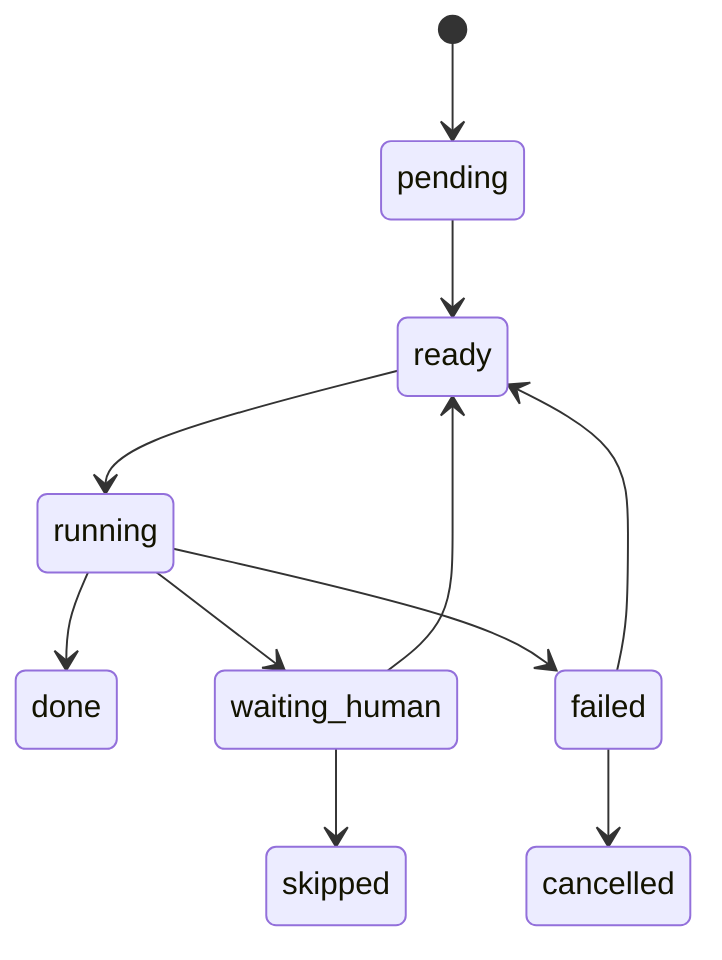
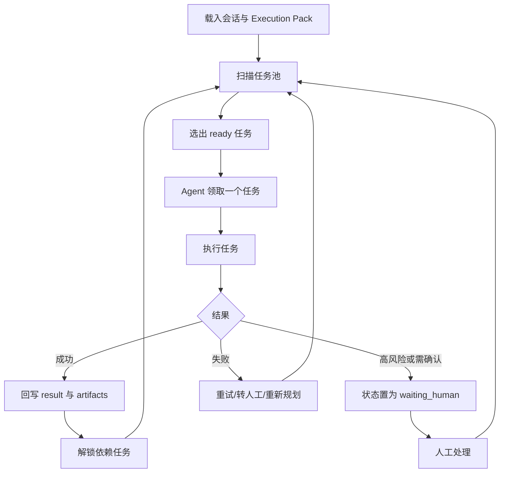
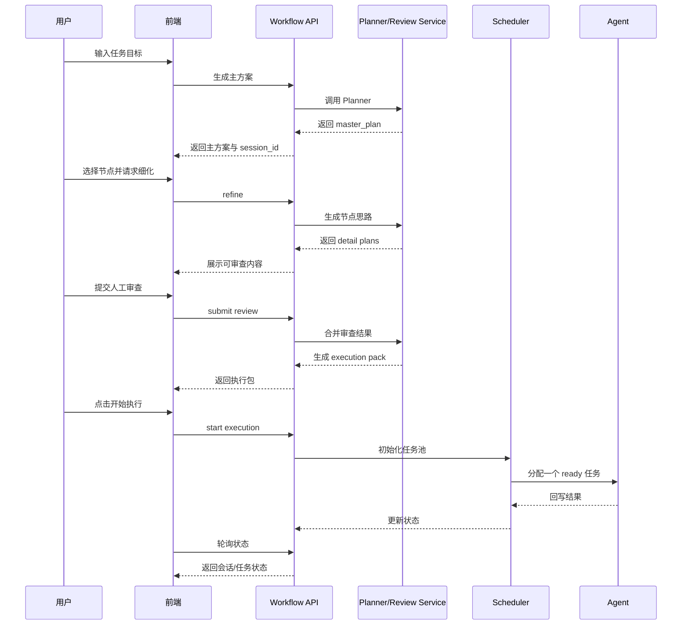
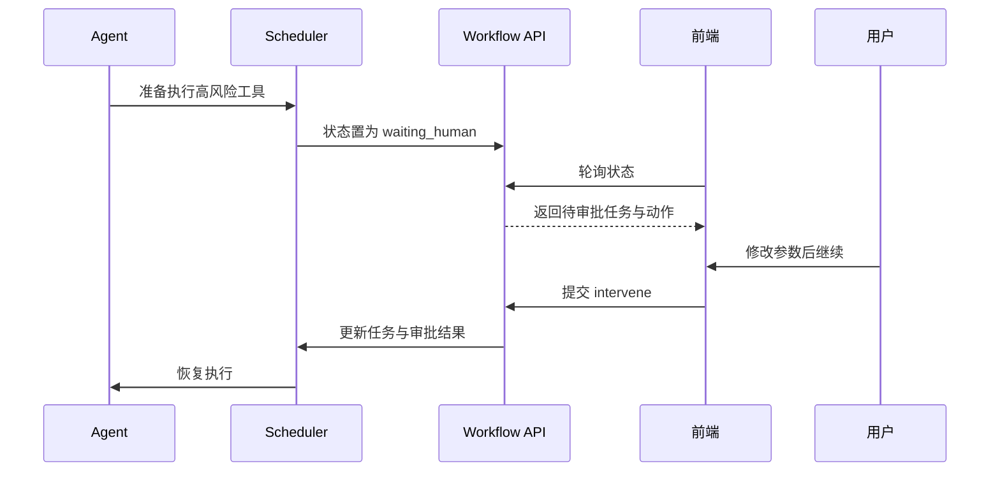

### AI 人机协同规划执行开发文档

## 一、文档目的

本文档用于把《`AI人机协同规划执行方案.md`》落成一份 **可直接进入研发阶段的项目开发文档**。

文档目标：

- **明确当前系统基线**：基于你当前 `remote-code-editor` 的前后端实现来设计，而不是脱离现有代码另起一套概念稿。
- **明确目标形态**：实现“AI 先规划、用户选重点、AI 细化、人工审查、任务池执行、运行中可介入”的协同执行系统。
- **明确研发边界**：先做可上线的 MVP，再逐步扩展为任务池化、审批化和节点化系统。
- **明确实施清单**：列出具体模块、接口、数据结构、文件改造点、状态机和开发阶段。

---

## 二、当前项目基线分析

基于当前代码，现有系统已经具备以下基础能力：

### 1. 工作流编排基础已存在
当前后端已经支持：

- 工作流图定义存储
- LangGraph 图构建
- 节点执行器注册
- 工作流运行 API
- 前端可视化编辑器

当前关键模块：

- `backend/workflow/builder.py`：将图定义构建为可执行图
- `backend/workflow/executor.py`：执行工作流图
- `backend/workflow/nodes/__init__.py`：注册节点执行器
- `frontend/src/components/workflow/WorkflowPanel.vue`：编辑器与运行面板主组件

### 2. Agent 已具备工具循环执行能力
当前 `agent_node.py` 已实现：

- 组装消息
- 调用 AI 获取 `tool_calls`
- 循环执行工具
- 把工具结果再喂回 AI
- 输出最终结果

但当前问题也很明确：

- **Agent 直接从 AI 输出进入工具执行，没有计划层**
- **没有任务池，只有连续迭代**
- **没有人工审查入口**
- **高风险工具没有前置审批**
- **失败重试、跳过、人工修正还没有结构化机制**

### 3. 运行状态展示能力已存在
当前已具备：

- `execution-state` 查询接口
- 内存态执行状态缓存
- 气泡流记录
- 前端轮询显示当前执行节点、工具、结果、AI 内容

现状优势：

- 已经有状态通道
- 已经有运行面板
- 已经有轮询机制
- 已经有前端高亮当前节点

现状不足：

- 状态只适用于“单轮执行过程展示”
- 没有承载“计划、节点思路、审查结果、任务池”的结构
- 目前主要依赖内存缓存，不适合复杂中断恢复

### 4. 前端交互承载点已存在
当前前端具备：

- 工作流编辑区
- 运行面板
- 工作流保存/加载
- 执行状态轮询
- 气泡流展示

因此本项目 **不需要从零做新页面**，而是在现有工作流面板基础上扩展：

- 协同规划区
- 节点细化区
- 人工审查区
- Execution Pack 预览区
- 任务池运行区
- 人工介入卡片

---

## 三、目标产品形态

本项目最终要实现一个 **人机协同规划执行工作台**。

### 标准流程

1. 用户输入任务目标
2. AI 生成主方案
3. 用户选中重点节点/模块
4. AI 生成这些节点的详细执行思路
5. 人工审查并修正
6. 系统生成最终 Execution Pack
7. Execution Pack 拆分为任务池
8. Agent 每次从任务池取一个小任务执行
9. 高风险或异常场景进入人工介入
10. 所有任务完成后输出最终结果

### 关键设计原则

- **先规划后执行**，不允许 Agent 一上来就自由发挥到底
- **任务池化执行**，不让 Agent 长时间连续漂移
- **人工纠偏显式化**，让用户改“计划 / 思路 / 任务”，而不是改隐式思维链
- **高风险动作可拦截**，支持执行前审批
- **状态可恢复**，执行中断后可继续

---

## 四、实施策略与技术决策

为了兼容你当前项目，建议采用 **两阶段实施策略**。

### 阶段性策略

#### Phase A：面板式 MVP
先在现有工作流系统上增加“协同规划执行模式”，不强制先做新的可视化节点类型。

特点：

- 改造成本低
- 能快速上线验证产品流程
- 主要扩展后端服务与前端运行面板
- Execution Pack 和任务池先作为业务对象存在，而不是必须先成为图节点

#### Phase B：节点化升级
在 MVP 稳定后，再把核心流程沉淀成新的工作流节点类型，例如：

- `goal_planner`
- `detail_generator`
- `human_review`
- `execution_pack_builder`
- `task_dispatcher`
- `task_agent_executor`

这样未来可以让这套能力成为工作流引擎的一部分。

### 技术决策

#### 1. 首版仍采用轮询，不立即上 WebSocket
理由：

- 当前前端已具备轮询逻辑
- 当前后端也已有状态查询接口
- 快速落地成本最低

调整建议：

- 将轮询频率从当前 `5000ms` 改为 `1000ms`
- 高优先状态下允许短轮询
- 后续 Phase 2 再升级为 WebSocket / SSE

#### 2. 状态源采用“DB 持久化 + cache 热数据”双层结构
理由：

- 当前 `cache.py` 只有内存态，不适合任务池和人工介入
- 但只用 DB 又会降低实时更新速度

方案：

- **DB 作为事实源**
- **内存 cache 作为实时镜像**
- 每个关键任务变更都落库
- 前端轮询优先走 cache 聚合态
- cache 丢失时可从 DB 重建

#### 3. 首版任务池采用串行执行
理由：

- 目前 `agent_node.py` 本身就是单循环模型
- 先把“拉取小任务 -> 执行 -> 回写 -> 审批”跑通更重要

约束：

- `max_concurrent_tasks = 1`
- 先不做并发任务调度
- 先不做多 Agent 协作执行

#### 4. 首版人工介入以高风险审批和任务纠偏为主
优先支持：

- 批准继续
- 编辑参数继续
- 修正任务约束
- 跳过任务
- 终止执行

首版暂不做：

- 多人协同审批
- 复杂任务迁移到不同执行器
- 全自动回滚

---

## 五、研发范围

### 本期要做

- 主方案生成
- 节点细化生成
- 人工审查提交
- Execution Pack 生成
- 任务池拆分
- 调度器选择任务
- Agent 按小任务执行
- 高风险任务审批
- 前端协同规划与任务池运行界面
- 运行态持久化与恢复

### 本期不做

- 多 Agent 并行任务执行
- 多人实时协同审查
- 复杂审批流（多级审批、多角色审批）
- 全量 WebSocket 推送
- 任务自动回滚脚本编排
- 完整 BPMN 级别流程设计器

---

## 六、目标架构设计

### 架构分层

#### 1. 交互层（Frontend）
负责：

- 输入任务目标
- 展示主方案树
- 选中节点/模块
- 展示节点执行思路
- 展示人工审查表单
- 展示 Execution Pack
- 展示任务池运行态
- 提供人工介入入口

#### 2. 协同规划层（Planner / Detail / Review）
负责：

- 根据任务目标生成主方案
- 根据选中节点生成详细执行思路
- 接收人工审查修改
- 合并生成最终可执行版本

#### 3. 执行编排层（Execution Pack / Task Pool / Scheduler）
负责：

- 将方案转换为 Execution Pack
- 将 Execution Pack 拆分为任务池
- 维护任务依赖、优先级和状态
- 为 Agent 选择下一个待执行任务
- 触发人工介入与重规划

#### 4. 执行层（Agent Executor）
负责：

- 每次消费一个 `ready` 任务
- 按任务约束执行工具调用
- 回写任务结果
- 标记风险与失败
- 返回下一步建议

#### 5. 状态层（DB + Cache + Bubble）
负责：

- 保存会话
- 保存主方案/节点思路/审查结果
- 保存任务池状态
- 保存人工介入记录
- 保存执行气泡流
- 支撑恢复与回放

---

## 七、核心对象设计

### 1. 协同执行会话 `ExecutionSession`
表示一次完整的人机协同执行过程。

建议字段：

- `id`
- `workflow_id`
- `goal`
- `workspace`
- `status`
- `current_phase`
- `current_task_id`
- `execution_pack_json`
- `final_result_json`
- `created_at`
- `updated_at`

推荐状态：

- `draft`
- `planning`
- `refining`
- `reviewing`
- `ready_to_execute`
- `executing`
- `waiting_human`
- `completed`
- `failed`
- `cancelled`

### 2. 主方案快照 `PlanSnapshot`
保存 AI 生成和人工修正后的主方案版本。

建议字段：

- `id`
- `session_id`
- `version`
- `source_type`（`ai` / `human_edited` / `merged`）
- `goal`
- `plan_json`
- `summary`
- `created_at`

### 3. 节点审查记录 `PlanNodeReview`
保存每个计划节点的细化思路与人工审查结果。

建议字段：

- `id`
- `session_id`
- `plan_version`
- `node_id`
- `title`
- `node_type`
- `selected`
- `detail_json`
- `review_status`
- `risk_level`
- `require_runtime_approval`
- `human_comments_json`
- `created_at`
- `updated_at`

推荐审查状态：

- `pending`
- `generated`
- `approved`
- `approved_with_changes`
- `rejected`
- `skipped`

### 4. 任务池任务 `ExecutionTask`
这是任务池的核心对象。

建议字段：

- `id`
- `session_id`
- `task_id`
- `parent_node_id`
- `title`
- `task_type`
- `status`
- `priority`
- `sequence`
- `dependencies_json`
- `inputs_json`
- `constraints_json`
- `success_criteria_json`
- `tool_hints_json`
- `assigned_executor`
- `retry_count`
- `max_retry_count`
- `requires_human_approval`
- `result_json`
- `error_message`
- `started_at`
- `finished_at`
- `created_at`
- `updated_at`

推荐任务状态：

- `pending`
- `ready`
- `running`
- `waiting_human`
- `done`
- `failed`
- `skipped`
- `cancelled`

### 5. 人工介入记录 `ExecutionIntervention`
用于记录任务级、会话级介入行为。

建议字段：

- `id`
- `session_id`
- `task_ref`
- `action`
- `status`
- `reason`
- `payload_json`
- `operator`
- `created_at`
- `resolved_at`

推荐动作类型：

- `approve`
- `edit_and_continue`
- `revise_logic`
- `skip_task`
- `requeue_task`
- `insert_task`
- `terminate`

---

## 八、数据库设计建议

### 设计原则

- 结构化字段用于可查询状态
- 大块方案与任务上下文使用 JSON 存储
- 保持与当前 `Workflow` 模型风格兼容
- 首版尽量避免过度拆表

### 推荐新增模型

#### 1. `WorkflowExecutionSession`
主会话表。

#### 2. `WorkflowPlanSnapshot`
保存主方案版本。

#### 3. `WorkflowPlanNodeReview`
保存节点细化与人工审查。

#### 4. `WorkflowExecutionTask`
保存任务池。

#### 5. `WorkflowExecutionIntervention`
保存人工介入记录。

### 是否需要单独任务事件表

#### MVP 结论
**先不单独建 `TaskEvent` 表**。

原因：

- 当前系统已经有 `bubble_records`
- 首版可复用气泡流作为时间线
- 后续若要做详细回放，再补 `TaskEvent`

---

## 九、Execution Pack 结构定义

Execution Pack 是会话进入执行阶段的正式输入。

### 推荐结构

```json
{
  "session_id": "sess-001",
  "goal": "完成用户任务",
  "workflow_id": "12",
  "workspace": "c:/Users/.../MyCodeBuddy/remote-code-editor",
  "master_plan": {
    "version": 3,
    "plan_nodes": []
  },
  "selected_nodes": ["plan-2", "plan-3"],
  "reviewed_node_plans": [],
  "global_constraints": [
    "优先复用现有实现",
    "高风险工具需人工确认"
  ],
  "execution_mode": {
    "task_execution_mode": "task_pool",
    "max_concurrent_tasks": 1,
    "require_human_approval_for": [
      "write_file",
      "execute_command",
      "delete_file"
    ]
  },
  "task_pool": {
    "selection_strategy": "topological_priority",
    "tasks": []
  },
  "scheduler": {
    "replan_on_failure": true,
    "allow_task_skip": true,
    "allow_human_requeue": true
  }
}
```

### Execution Pack 的职责边界

- 主方案负责表达整体目标与阶段
- 节点思路负责表达局部细化策略
- 任务池负责表达最小可执行单元
- 调度器负责选择下一任务
- Agent 只负责执行当前任务

---

## 十、任务池设计

### 任务粒度原则

每个任务都必须满足：

- 单一目标明确
- 输入和约束明确
- 成功条件明确
- 可独立追踪状态
- 可单独人工介入

### 推荐任务类型

- `analysis`
- `read`
- `modify`
- `verify`
- `checkpoint`
- `manual_review`
- `replan`

### 任务调度规则

首版采用：

- 按依赖关系解锁 `ready`
- 在 `ready` 中按优先级选择
- 同优先级按 `sequence` 执行
- 高风险任务先转 `waiting_human`
- 失败任务优先判断是否重试

### 任务状态流转



### 任务池调度循环



---

## 十一、后端详细设计

### 1. 模块拆分建议

在 `backend/workflow/` 下新增服务层：

- `services/planner_service.py`
- `services/detail_plan_service.py`
- `services/review_service.py`
- `services/execution_pack_service.py`
- `services/task_pool_service.py`
- `services/scheduler_service.py`
- `services/intervention_service.py`
- `services/session_state_service.py`

### 2. 现有文件改造清单

#### `backend/workflow/models.py`
新增：

- `WorkflowExecutionSession`
- `WorkflowPlanSnapshot`
- `WorkflowPlanNodeReview`
- `WorkflowExecutionTask`
- `WorkflowExecutionIntervention`

#### `backend/workflow/views.py`
新增接口：

- 主方案生成
- 节点细化
- 审查提交
- Execution Pack 构建
- 会话启动执行
- 任务列表查询
- 任务介入提交
- 会话详情查询

#### `backend/api/urls.py`
注册新的 workflow 协同执行 API。

#### `backend/workflow/cache.py`
扩展为：

- 会话热状态
- 当前任务快照
- 待处理人工命令队列
- 任务池摘要状态

#### `backend/workflow/executor.py`
扩展支持：

- 通过 `session_id` 执行协同会话
- 初始化任务池
- 驱动调度循环

#### `backend/workflow/nodes/agent_node.py`
扩展支持：

- 接收当前任务上下文而不是只接收大任务描述
- 在工具执行前执行高风险判断
- 等待人工审批
- 回写任务结果与任务状态
- 失败后支持重试建议和重规划触发

### 3. 新增内部服务职责

#### `planner_service.py`
职责：

- 根据目标生成主方案
- 输出 `plan_nodes`
- 归纳成功标准、假设、风险

#### `detail_plan_service.py`
职责：

- 根据选中节点生成详细执行思路
- 输出工具计划、回退策略、风险标记

#### `review_service.py`
职责：

- 保存人工审查意见
- 合并人工修改版本
- 判断节点是否允许进入执行阶段

#### `execution_pack_service.py`
职责：

- 聚合主方案、节点思路、人工审查结果
- 生成最终 Execution Pack

#### `task_pool_service.py`
职责：

- 将 Execution Pack 拆分为 `ExecutionTask`
- 维护依赖、优先级、约束、成功标准

#### `scheduler_service.py`
职责：

- 选择下一个 `ready` 任务
- 判断是否需要重试、跳过、重规划
- 更新任务状态与会话状态

#### `intervention_service.py`
职责：

- 接收人工指令
- 处理审批、改参、跳过、终止、插入任务
- 回写会话和任务状态

---

## 十二、后端 API 设计

### 1. 生成主方案

#### 接口
`POST /api/workflow/plan/generate/`

#### 请求体

```json
{
  "workflow_id": "12",
  "goal": "修复某模块中的配置读取逻辑",
  "workspace": "c:/Users/.../MyCodeBuddy/remote-code-editor"
}
```

#### 返回

```json
{
  "success": true,
  "session_id": "sess-001",
  "phase": "planning",
  "master_plan": {
    "goal": "修复某模块中的配置读取逻辑",
    "plan_nodes": []
  }
}
```

### 2. 生成节点细化思路

#### 接口
`POST /api/workflow/plan/refine/`

#### 请求体

```json
{
  "session_id": "sess-001",
  "selected_node_ids": ["plan-2", "plan-3"]
}
```

### 3. 提交人工审查结果

#### 接口
`POST /api/workflow/plan/review/submit/`

#### 请求体

```json
{
  "session_id": "sess-001",
  "reviews": [
    {
      "node_id": "plan-3",
      "review_status": "approved_with_changes",
      "human_comments": [
        "必须先读后写",
        "禁止直接覆盖已有文件"
      ],
      "require_runtime_approval": true
    }
  ]
}
```

### 4. 生成 Execution Pack

#### 接口
`POST /api/workflow/execution-pack/build/`

#### 请求体

```json
{
  "session_id": "sess-001"
}
```

### 5. 启动执行

#### 接口
`POST /api/workflow/executions/start/`

#### 请求体

```json
{
  "session_id": "sess-001"
}
```

#### 说明
执行开始后：

- 会话状态切为 `executing`
- 任务池初始化为 `ready/pending`
- 调度器启动
- 前端进入任务池轮询模式

### 6. 获取会话状态

#### 接口
`GET /api/workflow/executions/state/?session_id=sess-001`

#### 返回内容建议

- 会话状态
- 当前阶段
- 当前任务
- 主方案摘要
- 已审查节点摘要
- 任务池摘要
- 最新人工介入状态
- 气泡记录

### 7. 获取任务池列表

#### 接口
`GET /api/workflow/tasks/list/?session_id=sess-001`

### 8. 人工介入任务

#### 接口
`POST /api/workflow/tasks/intervene/`

#### 请求体示例

```json
{
  "session_id": "sess-001",
  "task_id": "task-002",
  "action": "edit_and_continue",
  "payload": {
    "constraints": [
      "必须先读后写",
      "写入前需再次确认目标路径"
    ]
  }
}
```

### 9. 查询会话详情

#### 接口
`GET /api/workflow/session/detail/?session_id=sess-001`

用于页面刷新恢复：

- 主方案
- 节点细化
- 审查结果
- Execution Pack
- 任务池
- 运行结果

---

## 十三、Agent 执行逻辑改造设计

### 当前问题
当前 `agent_node.py` 的模式是：

- 根据用户输入构建 messages
- 调 AI 获取工具调用
- 直接执行工具
- 再次迭代

这会导致：

- AI 缺乏计划级约束
- 工具执行前没有人工审查入口
- 无法按任务池粒度执行

### 改造目标
把 Agent 的执行模式改成：

> 输入不是“一个大任务”，而是“当前任务池中被调度出来的一个小任务 + 全局约束 + 上下文产出”。

### 推荐改造方式

#### 1. 新增任务上下文构造器
为 Agent 构造如下上下文：

- 原始总目标
- 当前任务标题
- 当前任务类型
- 当前任务输入
- 当前任务约束
- 上游任务产出
- 全局约束
- 当前允许使用的工具

#### 2. 工具执行前增加审批钩子
判断规则：

- 当前任务 `requires_human_approval = true`
- 或工具名命中高风险工具
- 或任务被人工标记为高风险

则：

- 会话状态置为 `waiting_human`
- 当前任务状态置为 `waiting_human`
- 写入待审批工具信息
- 阻塞等待人工介入结果

#### 3. 任务完成后不直接继续原循环
而是：

- 回写当前任务结果
- 标记任务 `done` / `failed`
- 让调度器决定后续任务
- 重新构造下一个任务上下文

#### 4. 失败时触发三类策略

- **自动重试**：错误可恢复
- **转人工**：高风险或重试达到上限
- **重规划**：说明原思路不适用

---

## 十四、状态缓存与恢复设计

### 当前问题
目前 `cache.py` 只存：

- 执行节点
- 执行详情
- 气泡流

不够承载：

- 会话阶段
- 当前任务
- 待审批动作
- 任务池摘要
- 人工指令队列

### 扩展建议

在 `cache.py` 中新增：

- `_execution_sessions`
- `_task_pool_snapshots`
- `_intervention_commands`
- `_human_waiting_states`

### 建议缓存结构

```json
{
  "session_id": "sess-001",
  "workflow_id": "12",
  "status": "waiting_human",
  "phase": "executing",
  "current_task": {
    "task_id": "task-002",
    "title": "修改目标实现",
    "type": "modify"
  },
  "pending_action": {
    "tool_name": "write_file",
    "arguments": {}
  },
  "task_pool_summary": {
    "done": 1,
    "running": 0,
    "waiting_human": 1,
    "pending": 2
  }
}
```

### 恢复原则

页面刷新后应通过会话详情接口恢复：

- 当前 phase
- 主方案与节点细化内容
- 已审核内容
- 当前任务状态
- 任务池列表
- 运行历史与气泡

---

## 十五、前端详细设计

### 1. 产品形态建议

基于现有 `WorkflowPanel.vue`，建议新增一个 **协同执行模式**，与当前“直接运行工作流”共存。

建议 UI 结构：

- 左侧仍保留工作流编辑器
- 右侧运行区升级为多阶段工作台

### 2. 右侧工作台建议分 5 个区块

#### 区块 A：任务目标区

字段：

- 任务目标输入框
- 工作区展示
- 生成主方案按钮

#### 区块 B：主方案区

字段：

- 主方案树
- 节点风险标签
- 节点选择勾选框
- 重新生成方案按钮

#### 区块 C：节点细化与人工审查区

字段：

- 节点执行思路卡片
- 编辑区
- 审查状态按钮
- 风险标记
- “通过 / 修改后通过 / 退回重生成 / 跳过”

#### 区块 D：Execution Pack 预览区

字段：

- 主方案摘要
- 选中节点摘要
- 人工约束摘要
- 任务池统计
- 启动执行按钮

#### 区块 E：任务池运行区

字段：

- 当前会话状态
- 当前任务
- 任务列表
- 当前任务气泡流
- 人工介入卡片

### 3. 前端新增组件建议

建议新增组件：

- `WorkflowCollabPlanPanel.vue`
- `MasterPlanTree.vue`
- `PlanNodeRefinePanel.vue`
- `HumanReviewCard.vue`
- `ExecutionPackPreview.vue`
- `TaskPoolBoard.vue`
- `TaskInterventionCard.vue`

### 4. 现有组件改造建议

#### `WorkflowPanel.vue`
改造内容：

- 增加协同规划入口
- 增加会话 `session_id` 管理
- 增加轮询协同会话状态
- 增加任务池列表和当前任务展示
- 把原 `execution-state` 轮询升级为会话态轮询

#### `WorkflowRun.vue`
改造内容：

- 增加会话阶段显示
- 增加当前任务卡片
- 增加待人工确认卡片
- 增加任务池摘要显示
- 增加审批按钮与任务操作入口

### 5. 前端数据流建议

#### 用户生成主方案

- 提交目标
- 获得 `session_id`
- 更新主方案树

#### 用户选节点生成细化

- 提交选中节点列表
- 获得细化结果
- 展示审查 UI

#### 用户完成审查后执行

- 提交审查结果
- 生成 Execution Pack
- 启动执行
- 开始轮询任务池状态

#### 运行中人工介入

- 收到 `waiting_human`
- 展示当前任务与待执行动作
- 用户操作后提交介入接口
- 状态继续推进

---

## 十六、与现有工作流系统的结合方式

### MVP 方案

#### 方案结论
**先不强制把“协同规划执行”拆成新的图节点**，而是先做成当前工作流系统上的“高级执行模式”。

理由：

- 当前图引擎已经可执行，但还不适合直接承接复杂审查中断逻辑
- 如果一开始就做全节点化，开发周期会显著拉长
- 先用业务服务 + 前端工作台把流程打通更现实

### V2 节点化升级方案

当 MVP 稳定后，可以再新增以下节点类型：

- `goal_planner`
- `node_selector`
- `detail_generator`
- `human_review`
- `execution_pack_builder`
- `task_dispatcher`
- `task_executor`

届时改造点包括：

- `backend/workflow/nodes/__init__.py` 注册新节点
- `builder.py` 支持新节点类型
- 前端节点库新增对应节点

---

## 十七、接口与状态时序

### 主流程时序



### 运行中人工介入时序



---

## 十八、开发阶段拆解

### Phase 1：数据层与后端能力

目标：先把会话、方案、任务池、人工介入的数据与 API 打通。

任务：

- 新增模型与迁移
- 新增协同执行 API
- 扩展 `cache.py`
- 增加 planner/detail/review/task_pool/scheduler 服务
- 完成 Execution Pack 生成与任务池初始化

交付结果：

- 能通过接口生成主方案
- 能细化节点
- 能提交审查
- 能产出任务池

### Phase 2：前端协同规划工作台

目标：让用户可以完整走通规划、细化、审查、生成执行包。

任务：

- `WorkflowPanel.vue` 增加协同执行模式
- 新增主方案树组件
- 新增节点细化与审查组件
- 新增 Execution Pack 预览组件
- 完成会话详情恢复逻辑

交付结果：

- 用户可以在前端走完“生成方案 -> 选节点 -> 审查 -> 生成执行包”

### Phase 3：任务池执行与人工介入

目标：打通真正的任务池执行循环。

任务：

- 调度器按 `ready` 选择任务
- Agent 执行单任务
- 任务结果回写
- 高风险工具审批
- 前端任务池板和人工介入卡片

交付结果：

- Agent 不再直接跑大任务，而是按小任务执行
- 用户可在运行中审批或修正

### Phase 4：稳定化与恢复

目标：让系统更可靠，适合真实使用。

任务：

- 页面刷新恢复
- 任务失败恢复
- 审计日志补全
- 轮询优化
- 任务池统计与搜索

交付结果：

- 会话可恢复
- 任务状态可追踪
- 人工介入有审计记录

---

## 十九、验收标准

### MVP 验收标准

必须满足：

- 用户可输入任务目标并生成主方案
- 用户可选择节点并生成节点细化思路
- 用户可提交人工审查结果
- 系统可生成 Execution Pack
- 系统可将执行包拆成任务池
- Agent 可按小任务顺序执行
- 命中高风险工具时可暂停等待人工确认
- 用户可审批 / 改参 / 跳过 / 终止
- 执行结果与气泡流可查看
- 页面刷新后能恢复当前会话信息

### 稳定性验收标准

- 任务状态不乱跳
- 执行中断后不会整包丢失
- 审查结果不会因为页面刷新丢失
- 至少支持 `write_file / execute_command / delete_file` 三类高风险工具审批

---

## 二十、测试方案

### 1. 单元测试

覆盖：

- Planner 输出结构校验
- 节点细化输出结构校验
- Review 合并逻辑
- Execution Pack 构建逻辑
- 任务池拆分逻辑
- 调度器选择逻辑
- 任务状态流转逻辑

### 2. 接口测试

覆盖：

- 主方案生成接口
- 节点细化接口
- 审查提交接口
- 执行包构建接口
- 执行启动接口
- 任务介入接口
- 会话详情接口

### 3. 前端联调测试

覆盖：

- 方案树显示
- 节点选择与细化
- 审查提交
- 启动执行
- 任务池显示
- 人工审批交互
- 页面刷新恢复

### 4. 场景测试

重点测试场景：

- 正常执行完整任务
- 高风险工具触发审批
- 工具执行失败后转人工
- 用户跳过任务
- 用户中途终止
- 页面刷新后恢复会话

---

## 二十一、风险与应对

### 风险 1：当前执行链路偏同步，不适合长等待

#### 应对
MVP 先允许短时间等待人工介入，后续再演进为后台任务 + WebSocket。

### 风险 2：仅靠内存缓存会丢状态

#### 应对
关键状态必须落库，cache 仅做热态。

### 风险 3：一开始节点化会拖慢整体开发

#### 应对
先做面板式 MVP，后做节点化升级。

### 风险 4：任务池拆分过细会增加交互负担

#### 应对
MVP 任务粒度控制在“用户能理解、Agent 能独立完成”的级别，不做过细拆分。

### 风险 5：Agent 仍可能在单任务内部漂移

#### 应对
给任务增加严格约束、工具白名单、成功标准和高风险审批。

---

## 二十二、推荐首版开发顺序

如果只按最小成本做出一版能用的，建议按下面顺序：

### 第 1 周

- 建模型
- 建会话 API
- 建主方案与节点细化 API

### 第 2 周

- 建审查与 Execution Pack 生成
- 建任务池初始化逻辑
- 前端做主方案和审查 UI

### 第 3 周

- 改造 `agent_node.py` 支持任务上下文
- 做调度器
- 做高风险人工介入

### 第 4 周

- 做运行面板任务池 UI
- 做刷新恢复
- 做测试与修 bug

---

## 二十三、结论

本开发文档的核心结论是：

- 当前项目已经有工作流、Agent、运行态和前端面板基础
- 最合理的实现方式不是重写整套工作流系统，而是 **在现有系统上新增一层协同规划 + 任务池调度 + 人工介入能力**
- 首版应优先做 **面板式协同执行模式**，先验证产品闭环
- 当闭环稳定后，再把能力沉淀为新的工作流节点类型

最终，系统会从：

> AI 直接根据大任务循环调用工具

升级为：

> AI 先生成方案，人选择重点，AI 细化，人审查修正，系统生成任务池，Agent 每次只执行一个被调度的小任务，必要时等待人工纠偏。

这才是适合你当前项目架构、又能真正提升可靠性的落地方向。

---

## 二十四、后续可继续补充的文档

下一步可以继续补两类文档：

- **接口详细字段文档**：把每个 API 的字段、校验规则、错误码写全
- **数据库表结构文档**：把 Django 模型和迁移方案进一步细化
- **前端页面交互文档**：把每个区域的按钮、状态、显示逻辑写清楚
- **任务池调度设计文档**：详细描述任务选择、失败恢复、重试、插队逻辑
- **Agent 任务执行协议文档**：详细描述 Agent 如何消费单任务上下文

如果进入下一步研发拆解，建议优先继续产出：

1. `接口设计文档`
2. `数据库设计文档`
3. `前端交互文档`
4. `开发任务拆解清单`
