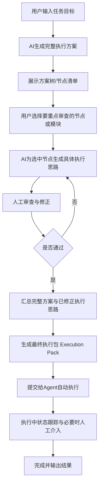
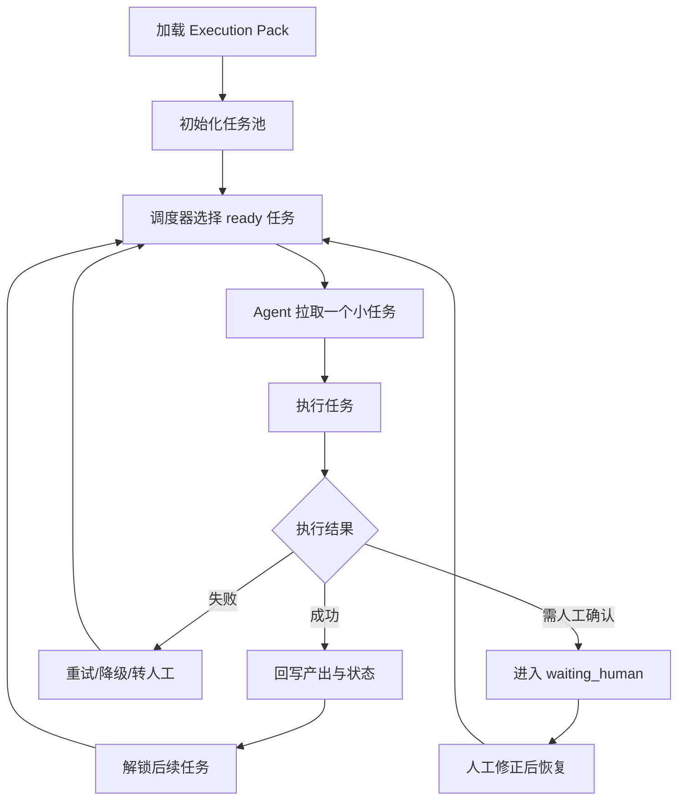
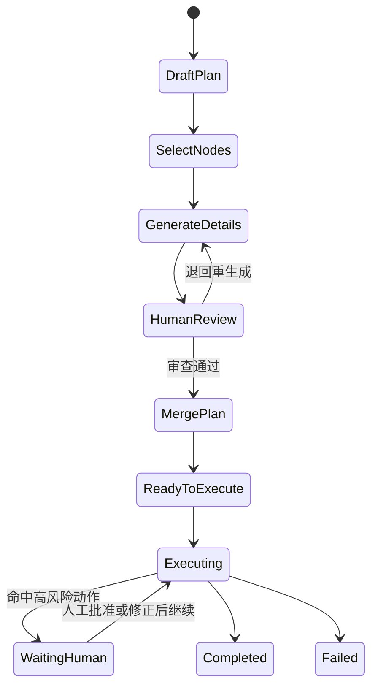

### AI 人机协同规划执行方案

> 已生成拆分版目录：`docs/AI人机协同规划执行/方案文档/README.md`
>
> 若需要按章节阅读、评审或继续补充，优先使用拆分版；当前文件保留为原始单文件版本。

## 一、方案目标

本方案用于解决 **AI 在执行复杂任务时依赖概率推理、逻辑不一定稳定** 的问题。
核心思路是将原本“AI 边想边执行”的流程，改造为 **先规划、再局部细化、再人工审查、最后自动执行** 的人机协同闭环。

目标包括：

- **提升执行正确率**：让人工在关键逻辑处纠偏，而不是等执行出错后再补救。
- **降低高风险操作风险**：在写文件、执行命令、删除内容等动作前增加审查机制。
- **保留 AI 生成效率**：让 AI 负责快速产出方案与执行思路。
- **强化人工精准把控**：让人重点审查目标理解、步骤顺序、工具选择和风险约束。
- **支撑最终自动化执行**：将确认后的完整方案提交给 Agent 自动执行，避免人工全程接管。

---

## 二、总体设计思想

整体流程分为两层：

- **规划层**：AI 生成方案，人负责挑重点、审逻辑、加约束。
- **执行层**：Agent 严格按照确认后的方案与约束自动执行。

也就是说，不让 AI 直接把“隐式概率推理”变成动作，而是先把它变成 **可审阅的结构化产物**，再由人工修正，最后再执行。

一句话概括：

> **AI 负责出方案，人负责改方案，Agent 负责按确认后的方案执行。**

---

## 三、完整工作流程



---

## 四、四阶段协同流程

### 阶段 1：任务目标生成完整执行方案

#### 输入
用户输入任务目标，例如：

- 修复某个模块 Bug
- 为现有系统补全某项功能
- 分析代码结构并实施改造
- 自动化处理某一类工作流任务

#### AI 输出
AI 先不直接执行，而是生成一份 **结构化主方案**，建议包含以下内容：

- 任务理解
- 成功标准
- 前置假设
- 风险点
- 分阶段计划
- 节点/模块列表
- 建议执行顺序

#### 示例结构

```json
{
  "goal": "完成用户指定任务",
  "success_criteria": [
    "结果可执行",
    "不破坏现有结构",
    "具备可验证性"
  ],
  "assumptions": [
    "工作区代码可读取",
    "目标模块存在"
  ],
  "risks": [
    "需求理解可能偏差",
    "可能误改现有文件"
  ],
  "plan_nodes": [
    {
      "id": "plan-1",
      "title": "分析现有结构",
      "type": "analysis",
      "objective": "定位相关模块与依赖"
    },
    {
      "id": "plan-2",
      "title": "确认改动范围",
      "type": "scope",
      "objective": "明确要修改的文件与边界"
    },
    {
      "id": "plan-3",
      "title": "实施变更",
      "type": "implementation",
      "objective": "完成目标功能或修复"
    },
    {
      "id": "plan-4",
      "title": "验证结果",
      "type": "verification",
      "objective": "检查结果是否符合成功标准"
    }
  ]
}
```

---

### 阶段 2：用户选择节点，AI 生成局部执行思路

这一阶段用于解决“整体方案没问题，但某些步骤逻辑可能不可靠”的问题。

#### 用户动作
用户可以从主方案中选择：

- 某个节点
- 某几个模块
- 某个关键阶段
- 某类高风险步骤

例如：

- `plan-2 确认改动范围`
- `plan-3 实施变更`

#### AI 输出
AI 针对选中的节点生成更细的 **执行思路草案**，用于人工审查，而不是立刻执行。

建议每个节点输出：

- 节点目标
- 需要的输入信息
- 推理依据
- 具体步骤
- 计划使用的工具
- 风险点
- 回退策略
- 预期产出

#### 示例结构

```json
{
  "node_id": "plan-3",
  "title": "实施变更",
  "intent": "基于现有模块做最小必要修改",
  "required_inputs": [
    "目标文件路径",
    "现有函数结构",
    "依赖关系"
  ],
  "execution_thoughts": [
    "先读取目标文件确认结构",
    "定位需要修改的函数或区域",
    "生成最小改动补丁",
    "最后进行结果验证"
  ],
  "tool_plan": [
    { "tool": "read_file", "purpose": "读取现有实现" },
    { "tool": "search_content", "purpose": "定位相关符号" },
    { "tool": "write_file", "purpose": "写入修正后的内容" }
  ],
  "risks": [
    "可能覆盖已有逻辑",
    "可能遗漏关联修改"
  ],
  "fallback": "如定位失败，则先输出分析结论，不直接执行写入"
}
```

---

### 阶段 3：人工审查与修正

这是整套方案的核心。

人工不需要接管全部推理，只需要针对 **最容易出错、最影响结果、最有风险** 的部分做修正。

#### 人工审查重点

- **任务理解是否正确**
- **步骤顺序是否合理**
- **是否遗漏关键步骤**
- **工具选择是否合适**
- **是否应先读后写**
- **是否需要增加约束**
- **是否存在高风险动作需要再次审批**

#### 建议支持的人工操作

- **通过**：当前执行思路合理，允许进入下一步。
- **编辑执行思路**：直接修改步骤、顺序、工具计划。
- **追加约束**：例如“禁止覆盖原文件”“必须先搜索现有实现”。
- **退回 AI 重生成**：整体思路不合理时，携带人工意见重新生成。
- **跳过节点**：当前节点无需执行。
- **标记高风险**：后续执行时必须人工确认。

#### 人工审查结果示例

```json
{
  "node_id": "plan-3",
  "review_status": "approved_with_changes",
  "human_comments": [
    "必须先读取现有文件，不可直接创建新文件",
    "写入前需确认目标路径和影响范围"
  ],
  "revised_execution_thoughts": [
    "先列目录确认路径",
    "再读取目标文件结构",
    "最后决定是否执行写入"
  ],
  "risk_level": "high",
  "require_runtime_approval": true
}
```

---

### 阶段 4：汇总确认后的方案，提交 Agent 自动执行

前面三个阶段结束后，系统不应再把“原始需求”直接交给 Agent，而应把 **经过人工确认和修正后的完整执行包** 提交给 Agent。

这一步的核心不是“把聊天记录继续喂给 AI”，而是构建一份明确、可执行、可约束的 **Execution Pack**。

---

## 五、Execution Pack 设计

### 核心作用
Execution Pack 是最终交给 Agent 执行的标准输入，确保 Agent 不是自由发挥，而是 **在确认后的方案与约束下自动执行**。

进一步来说，Execution Pack 不一定要被设计成“一次性整包跑完”的静态结构，**更适合升级为兼容任务池的执行容器**：

- 上层仍然保存完整目标、主方案、人工修正意见和全局约束
- 下层把可执行部分拆成一组细粒度任务单元
- Agent 每次只从任务池中取出一个小任务执行
- 每个小任务执行完成后回写状态、产出、风险和下一步建议
- 调度器再决定继续取下一个任务、重新规划，还是等待人工介入

这样设计的好处是：

- **更稳**：避免 Agent 一次拿到大目标后连续自由发挥太久
- **更可控**：每个任务都可以单独审批、跳过、重试或替换
- **更适合人机协作**：人工可以插手某个具体任务，而不是重看整包计划
- **更容易恢复**：执行中断后可以从任务池状态恢复，而不是整轮重跑
- **更适合扩展调度能力**：后续可以支持优先级、依赖、重试、失败转人工

### 建议包含内容

Execution Pack 建议分成两层：

#### 1. 规划与约束层

- 原始任务目标
- AI 生成的主方案
- 用户选中的重点节点
- 节点的详细执行思路
- 人工修正意见
- 全局执行约束
- 运行期审批规则

#### 2. 任务池执行层

- 任务池 `task_pool`
- 任务依赖关系 `dependencies`
- 任务状态 `pending / ready / running / waiting_human / done / failed / skipped`
- 任务优先级 `priority`
- 任务类型 `analysis / read / modify / verify / checkpoint`
- 任务产出 `artifacts`
- 失败重试与回退策略
- 调度规则 `scheduler`

### 任务池化设计思路

任务池不是简单把步骤编号列出来，而是把“可执行的最小工作单元”标准化。每个任务都应具备：

- **明确目标**：这一步到底要完成什么
- **明确输入**：依赖哪些上游结论、文件、参数或人工意见
- **明确约束**：是否只读、是否允许写入、是否必须人工确认
- **明确完成条件**：什么结果算任务完成
- **明确产出物**：把什么内容写回上下文或执行缓存

这样 Agent 的工作模式就从：

> 收到一个大任务后连续推理和执行

变成：

> 从任务池拉取一个当前可执行的小任务，完成后提交结果，再决定下一步

### 推荐执行循环



### 示例结构

```json
{
  "goal": "完成用户任务",
  "master_plan": {
    "plan_nodes": []
  },
  "selected_nodes": ["plan-2", "plan-3"],
  "reviewed_node_plans": [
    {
      "node_id": "plan-2",
      "status": "approved"
    },
    {
      "node_id": "plan-3",
      "status": "approved_with_changes",
      "constraints": [
        "必须先读后写",
        "禁止直接覆盖已有文件"
      ]
    }
  ],
  "global_constraints": [
    "优先复用现有实现",
    "高风险工具需人工确认"
  ],
  "execution_mode": {
    "allow_auto_execution": true,
    "task_execution_mode": "task_pool",
    "require_human_approval_for": [
      "write_file",
      "execute_command",
      "delete_file"
    ]
  },
  "task_pool": {
    "selection_strategy": "topological_priority",
    "max_concurrent_tasks": 1,
    "tasks": [
      {
        "task_id": "task-001",
        "node_id": "plan-1",
        "title": "分析目标模块结构",
        "type": "analysis",
        "status": "ready",
        "priority": 100,
        "dependencies": [],
        "inputs": {
          "module_hint": "目标模块"
        },
        "constraints": [
          "只读，不允许写文件"
        ],
        "success_criteria": [
          "定位目标模块和关键文件",
          "输出依赖与改动建议"
        ],
        "tool_hints": [
          "search_content",
          "read_file"
        ],
        "artifacts": []
      },
      {
        "task_id": "task-002",
        "node_id": "plan-3",
        "title": "修改目标实现",
        "type": "modify",
        "status": "pending",
        "priority": 80,
        "dependencies": ["task-001"],
        "constraints": [
          "必须先读后写",
          "写入前需人工确认"
        ],
        "success_criteria": [
          "完成最小必要修改",
          "不破坏现有接口"
        ],
        "tool_hints": [
          "read_file",
          "write_file"
        ],
        "artifacts": []
      },
      {
        "task_id": "task-003",
        "node_id": "plan-4",
        "title": "验证修改结果",
        "type": "verify",
        "status": "pending",
        "priority": 60,
        "dependencies": ["task-002"],
        "constraints": [
          "验证失败时不得自动覆盖修复"
        ],
        "success_criteria": [
          "输出验证结论",
          "列出剩余风险"
        ],
        "tool_hints": [
          "execute_command",
          "read_file"
        ],
        "artifacts": []
      }
    ]
  },
  "scheduler": {
    "replan_on_failure": true,
    "allow_human_requeue": true,
    "allow_task_skip": true,
    "escalate_to_human_when": [
      "high_risk_tool",
      "task_failed_twice",
      "dependency_missing"
    ]
  }
}
```

### 任务池与人工协作的结合方式

如果采用任务池模式，人工介入将会更细粒度，建议支持以下操作：

- **批准某个任务执行**
- **修改某个任务的约束或参数**
- **将某个任务退回重新生成**
- **跳过某个任务并记录原因**
- **提升或降低某个任务优先级**
- **人工插入一个新任务**
- **把失败任务转为人工处理任务**

这意味着，人工不再只是在“整份方案”层面审查，也可以在“单个任务单元”层面精细纠偏。

### 推荐的数据边界

为了避免任务池无限膨胀，建议明确这几个边界：

- 主方案负责表达 **为什么做、做哪些阶段**
- 节点思路负责表达 **某一块准备怎么做**
- 任务池负责表达 **下一批最小可执行单元是什么**
- Agent 只消费 **当前 ready 的任务**，而不是直接消费整份主方案

换句话说：

> 主方案是战略层，节点思路是战术层，任务池是执行层。

---

## 六、推荐系统角色分工


为了让流程清晰，建议在系统设计上抽象出以下角色：

### 1. Planner AI
负责：

- 根据用户目标生成完整主方案
- 拆解节点与阶段
- 输出风险与假设

### 2. Detail AI
负责：

- 对用户选中的节点生成详细执行思路
- 输出工具计划、执行顺序和回退策略

### 3. Human Reviewer
负责：

- 审查 AI 的逻辑正确性与合理性
- 修正步骤、约束和风险控制策略
- 标记需要二次审批的动作

### 4. Executor Agent
负责：

- 依据最终 Execution Pack 和任务池调度规则执行
- 每次从 `task_pool` 中拉取一个 `ready` 小任务执行
- 在高风险节点等待人工放行
- 回写任务产出、任务状态和下一步建议
- 输出执行过程和结果

### 5. Scheduler / Task Dispatcher
负责：

- 根据依赖关系、优先级和状态选择下一个可执行任务
- 在任务完成后解锁后续任务
- 在任务失败后触发重试、降级或转人工
- 在需要时触发重规划或允许人工插入新任务


---

## 七、运行期人工介入机制

即便前期方案已经审查通过，运行期仍应保留人工接管能力，特别是在高风险动作出现时。

### 推荐触发场景

- 即将执行高风险工具：
  - `write_file`
  - `execute_command`
  - `delete_file`
- AI 连续多轮未收敛
- 工具调用参数明显可疑
- 工具执行失败
- 用户手动点击“暂停并接管”

### 推荐状态机



### 运行期建议支持的动作

- **批准继续执行**
- **编辑参数后执行**
- **插入纠偏指令并重规划**
- **跳过当前步骤**
- **人工填写工具结果继续**
- **终止本次执行**

---

## 八、前端交互设计建议

建议把交互拆成以下几个区域：

### 1. 任务目标区
用于输入用户的总任务目标。

### 2. 完整方案区
展示 AI 生成的主方案树，包含：

- 节点列表
- 阶段结构
- 风险标记
- 成功标准

### 3. 节点选择与细化区
用于勾选需要重点审查的节点，并触发 AI 生成局部执行思路。

### 4. 人工审查区
用于：

- 查看执行思路
- 编辑步骤
- 添加约束
- 标记风险
- 退回 AI 重生成

### 5. 最终执行区
用于：

- 预览最终 Execution Pack
- 提交 Agent 执行
- 查看执行状态
- 在运行中进行必要的人工介入

---

## 九、后端能力设计建议

### 1. 主方案生成接口
输入任务目标，输出主方案。

### 2. 节点细化接口
输入选中的节点，输出节点级执行思路。

### 3. 人工审查提交接口
提交人工修改、补充约束与审批结果。

### 4. 执行包合并逻辑
将主方案、细化思路和人工修正结果合并为 Execution Pack。

### 5. 任务池生成与拆分逻辑
将确认后的节点思路拆分为可执行的小任务，写入 `task_pool`，并建立依赖关系、优先级、约束和完成条件。

### 6. 调度器接口 / 服务
根据任务状态、优先级和依赖关系，为 Agent 分配下一个 `ready` 任务，并在任务结束后更新池内状态。

### 7. Agent 执行接口
让 Agent 以 Execution Pack 为约束上下文执行，并采用“每次只消费一个任务池小任务”的执行模式，而不是仅基于原始用户输入连续自由执行。

### 8. 任务结果回写逻辑
在每个小任务结束后，回写任务状态、产出物、失败原因、人工意见和可能的后续建议。

### 9. 运行期介入接口
当执行进入 `waiting_human` 时，允许前端提交人工动作，也允许人工对任务池中的单个任务执行审批、改参、跳过、重排或重入队。


---

## 十、数据结构建议

在执行状态中可增加以下字段，用于支撑前端展示和运行期介入：

```json
{
  "status": "waiting_human",
  "details": {
    "master_plan": {},
    "selected_nodes": [],
    "node_thoughts": [],
    "review_status": {},
    "execution_pack": {},
    "pending_action": {
      "type": "tool_call",
      "tool_name": "write_file",
      "arguments": {}
    },
    "human_review_reason": "高风险工具待确认"
  }
}
```

同时建议记录以下审计信息：

- 人工在哪一轮介入
- 改了什么
- 为什么修改
- 修改后执行了什么

推荐新增气泡类型：

- `human_review`
- `human_logic_revision`
- `human_action_edit`
- `human_approval`
- `human_reject`

---

## 十一、MVP 最小可用版本建议

如果要尽快落地，建议第一版先做最小闭环，不要一开始做过度复杂的多人协作与全局回滚。

### MVP 建议只做以下能力

- 用户输入任务目标
- AI 生成主方案
- 用户选择节点
- AI 生成节点执行思路
- 人工修正并确认
- 生成 Execution Pack
- Agent 按确认方案执行
- 高风险工具执行前人工确认

### MVP 优先支持的运行期动作

- **继续执行**
- **编辑参数后执行**
- **终止执行**

### MVP 首批拦截工具

- `write_file`
- `execute_command`
- `delete_file`

---

## 十二、建议落地顺序

### Phase 1：规划—审查—执行闭环

目标：

- 主方案生成
- 节点选择
- 细化思路生成
- 人工审查
- Execution Pack 合并
- 自动执行

### Phase 2：运行中人工断点

目标：

- 高风险工具审批
- 参数编辑后继续
- 纠偏指令回写并重规划

### Phase 3：稳定化与可回放

目标：

- 方案版本化
- 审查记录持久化
- 执行包历史管理
- 执行过程回放
- 后续接入 WebSocket/SSE 优化体验

---

## 十三、核心价值总结

这套流程的本质是：

- **让 AI 负责生成**：快速产出方案与思路
- **让人工负责纠偏**：修正逻辑、步骤、工具和约束
- **让 Agent 负责执行**：在受控前提下自动化落地

最终实现的是一种更稳定的执行模式：

> **先把 AI 的想法变成结构化方案，再让人修正关键逻辑，最后让 Agent 只执行被确认过的版本。**

这比让 Agent 直接基于概率推理边想边干，更适合需要可靠性、可控性和可追踪性的任务场景。

---

## 十四、后续可继续补充的方向

后续可以在这份方案上继续扩展：

- 更细的页面与交互原型
- 后端接口字段定义
- `Execution Pack` 标准协议
- 运行期审批状态流转
- 前后端改造清单
- 与当前工作流系统的节点映射关系

如果进入实现阶段，可继续拆成：

- 产品交互稿
- 接口设计稿
- 前端组件设计
- 后端模块改造清单
- Agent 执行链路改造方案
