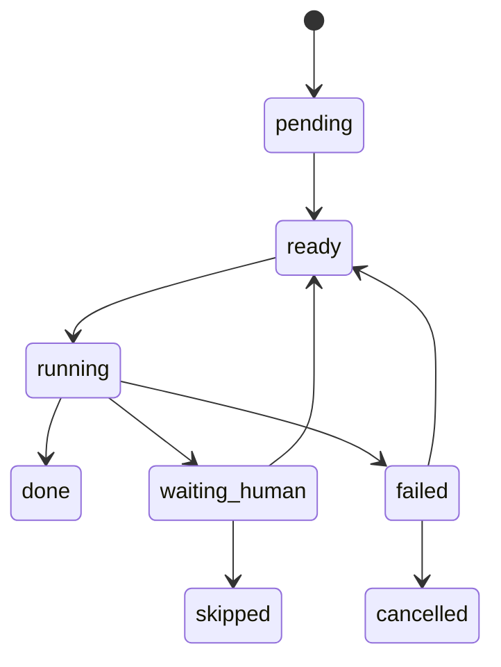
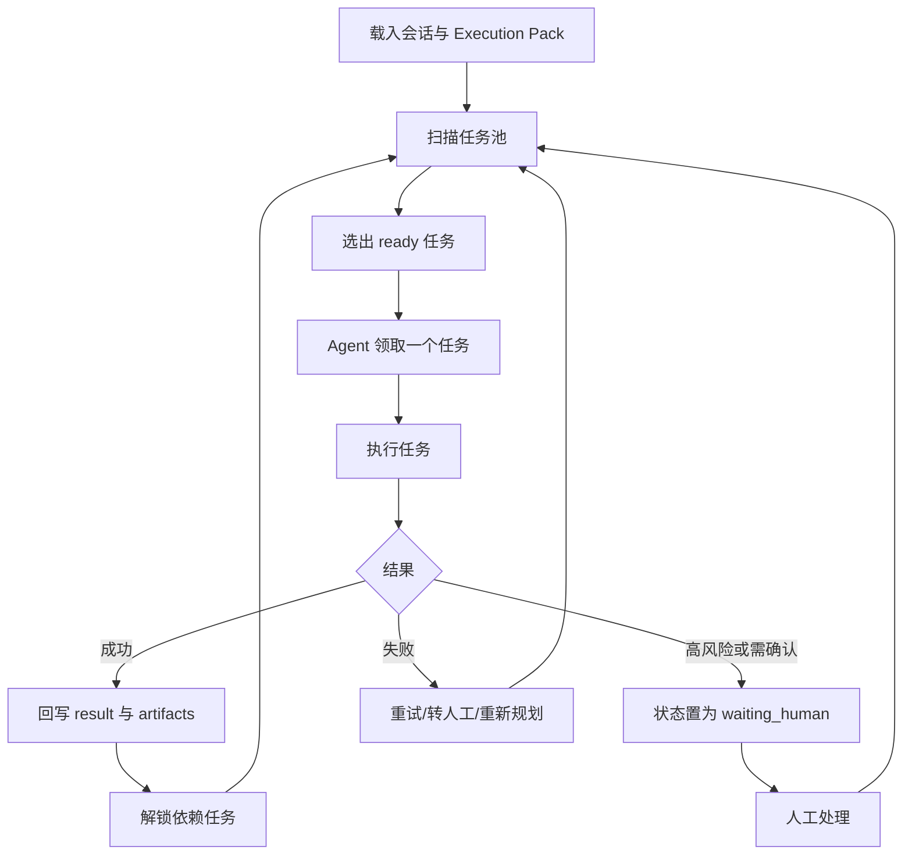

### AI 人机协同规划执行开发文档

## 十、任务池设计

### 任务粒度原则

每个任务都必须满足：

- 单一目标明确
- 输入和约束明确
- 成功条件明确
- 可独立追踪状态
- 可单独人工介入

### 推荐任务类型

- `analysis`
- `read`
- `modify`
- `verify`
- `checkpoint`
- `manual_review`
- `replan`

### 任务调度规则

首版采用：

- 按依赖关系解锁 `ready`
- 在 `ready` 中按优先级选择
- 同优先级按 `sequence` 执行
- 高风险任务先转 `waiting_human`
- 失败任务优先判断是否重试

### 任务状态流转

### 任务池调度循环

---
