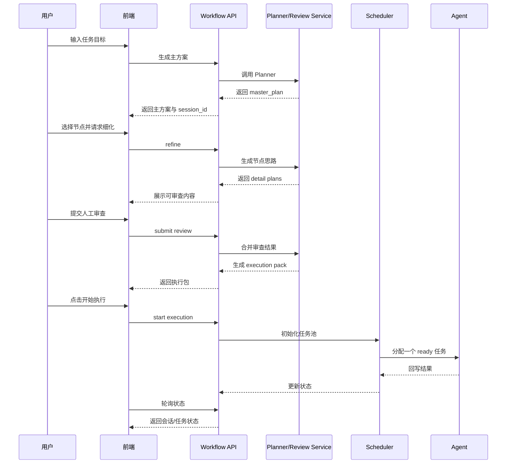
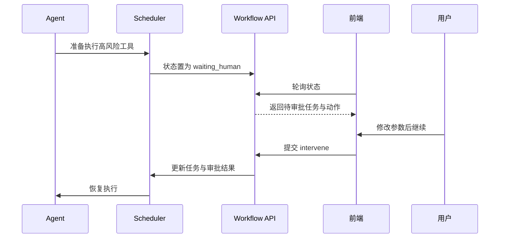

### AI 人机协同规划执行开发文档

## 十七、接口与状态时序

### 主流程时序

```mermaid
sequenceDiagram
    participant U as 用户
    participant FE as 前端
    participant API as Workflow API
    participant P as Planner/Review Service
    participant S as Scheduler
    participant A as Agent

    U->>FE: 输入任务目标
    FE->>API: 生成主方案
    API->>P: 调用 Planner
    P-->>API: 返回 master_plan
    API-->>FE: 返回主方案与 session_id

    U->>FE: 选择节点并请求细化
    FE->>API: refine
    API->>P: 生成节点思路
    P-->>API: 返回 detail plans
    API-->>FE: 展示可审查内容

    U->>FE: 提交人工审查
    FE->>API: submit review
    API->>P: 合并审查结果
    P-->>API: 生成 execution pack
    API-->>FE: 返回执行包

    U->>FE: 点击开始执行
    FE->>API: start execution
    API->>S: 初始化任务池
    S->>A: 分配一个 ready 任务
    A-->>S: 回写结果
    S-->>API: 更新状态
    FE->>API: 轮询状态
    API-->>FE: 返回会话/任务状态
```

### 运行中人工介入时序

```mermaid
sequenceDiagram
    participant A as Agent
    participant S as Scheduler
    participant API as Workflow API
    participant FE as 前端
    participant U as 用户

    A->>S: 准备执行高风险工具
    S->>API: 状态置为 waiting_human
    FE->>API: 轮询状态
    API-->>FE: 返回待审批任务与动作
    U->>FE: 修改参数后继续
    FE->>API: 提交 intervene
    API->>S: 更新任务与审批结果
    S->>A: 恢复执行
```

---
