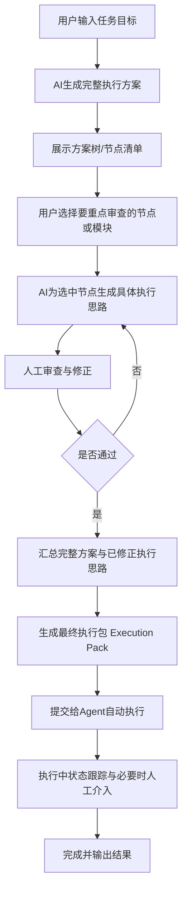

### AI 人机协同规划执行方案

## 三、完整工作流程

```mermaid
flowchart TD
    A[用户输入任务目标] --> B[AI生成完整执行方案]
    B --> C[展示方案树/节点清单]

    C --> D[用户选择要重点审查的节点或模块]
    D --> E[AI为选中节点生成具体执行思路]

    E --> F[人工审查与修正]
    F --> G{是否通过}
    G -- 否 --> E
    G -- 是 --> H[汇总完整方案与已修正执行思路]

    H --> I[生成最终执行包 Execution Pack]
    I --> J[提交给Agent自动执行]
    J --> K[执行中状态跟踪与必要时人工介入]
    K --> L[完成并输出结果]
```

---
