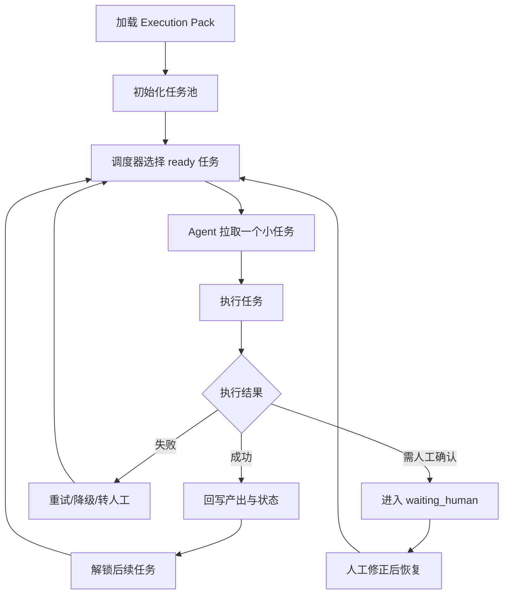

### AI 人机协同规划执行方案

## 五、Execution Pack 设计

### 核心作用
Execution Pack 是最终交给 Agent 执行的标准输入，确保 Agent 不是自由发挥，而是 **在确认后的方案与约束下自动执行**。

进一步来说，Execution Pack 不一定要被设计成“一次性整包跑完”的静态结构，**更适合升级为兼容任务池的执行容器**：

- 上层仍然保存完整目标、主方案、人工修正意见和全局约束
- 下层把可执行部分拆成一组细粒度任务单元
- Agent 每次只从任务池中取出一个小任务执行
- 每个小任务执行完成后回写状态、产出、风险和下一步建议
- 调度器再决定继续取下一个任务、重新规划，还是等待人工介入

这样设计的好处是：

- **更稳**：避免 Agent 一次拿到大目标后连续自由发挥太久
- **更可控**：每个任务都可以单独审批、跳过、重试或替换
- **更适合人机协作**：人工可以插手某个具体任务，而不是重看整包计划
- **更容易恢复**：执行中断后可以从任务池状态恢复，而不是整轮重跑
- **更适合扩展调度能力**：后续可以支持优先级、依赖、重试、失败转人工

### 建议包含内容

Execution Pack 建议分成两层：

#### 1. 规划与约束层

- 原始任务目标
- AI 生成的主方案
- 用户选中的重点节点
- 节点的详细执行思路
- 人工修正意见
- 全局执行约束
- 运行期审批规则

#### 2. 任务池执行层

- 任务池 `task_pool`
- 任务依赖关系 `dependencies`
- 任务状态 `pending / ready / running / waiting_human / done / failed / skipped`
- 任务优先级 `priority`
- 任务类型 `analysis / read / modify / verify / checkpoint`
- 任务产出 `artifacts`
- 失败重试与回退策略
- 调度规则 `scheduler`

### 任务池化设计思路

任务池不是简单把步骤编号列出来，而是把“可执行的最小工作单元”标准化。每个任务都应具备：

- **明确目标**：这一步到底要完成什么
- **明确输入**：依赖哪些上游结论、文件、参数或人工意见
- **明确约束**：是否只读、是否允许写入、是否必须人工确认
- **明确完成条件**：什么结果算任务完成
- **明确产出物**：把什么内容写回上下文或执行缓存

这样 Agent 的工作模式就从：

> 收到一个大任务后连续推理和执行

变成：

> 从任务池拉取一个当前可执行的小任务，完成后提交结果，再决定下一步

### 推荐执行循环



### 示例结构

```json
{
  "goal": "完成用户任务",
  "master_plan": {
    "plan_nodes": []
  },
  "selected_nodes": ["plan-2", "plan-3"],
  "reviewed_node_plans": [
    {
      "node_id": "plan-2",
      "status": "approved"
    },
    {
      "node_id": "plan-3",
      "status": "approved_with_changes",
      "constraints": [
        "必须先读后写",
        "禁止直接覆盖已有文件"
      ]
    }
  ],
  "global_constraints": [
    "优先复用现有实现",
    "高风险工具需人工确认"
  ],
  "execution_mode": {
    "allow_auto_execution": true,
    "task_execution_mode": "task_pool",
    "require_human_approval_for": [
      "write_file",
      "execute_command",
      "delete_file"
    ]
  },
  "task_pool": {
    "selection_strategy": "topological_priority",
    "max_concurrent_tasks": 1,
    "tasks": [
      {
        "task_id": "task-001",
        "node_id": "plan-1",
        "title": "分析目标模块结构",
        "type": "analysis",
        "status": "ready",
        "priority": 100,
        "dependencies": [],
        "inputs": {
          "module_hint": "目标模块"
        },
        "constraints": [
          "只读，不允许写文件"
        ],
        "success_criteria": [
          "定位目标模块和关键文件",
          "输出依赖与改动建议"
        ],
        "tool_hints": [
          "search_content",
          "read_file"
        ],
        "artifacts": []
      },
      {
        "task_id": "task-002",
        "node_id": "plan-3",
        "title": "修改目标实现",
        "type": "modify",
        "status": "pending",
        "priority": 80,
        "dependencies": ["task-001"],
        "constraints": [
          "必须先读后写",
          "写入前需人工确认"
        ],
        "success_criteria": [
          "完成最小必要修改",
          "不破坏现有接口"
        ],
        "tool_hints": [
          "read_file",
          "write_file"
        ],
        "artifacts": []
      },
      {
        "task_id": "task-003",
        "node_id": "plan-4",
        "title": "验证修改结果",
        "type": "verify",
        "status": "pending",
        "priority": 60,
        "dependencies": ["task-002"],
        "constraints": [
          "验证失败时不得自动覆盖修复"
        ],
        "success_criteria": [
          "输出验证结论",
          "列出剩余风险"
        ],
        "tool_hints": [
          "execute_command",
          "read_file"
        ],
        "artifacts": []
      }
    ]
  },
  "scheduler": {
    "replan_on_failure": true,
    "allow_human_requeue": true,
    "allow_task_skip": true,
    "escalate_to_human_when": [
      "high_risk_tool",
      "task_failed_twice",
      "dependency_missing"
    ]
  }
}
```

### 任务池与人工协作的结合方式

如果采用任务池模式，人工介入将会更细粒度，建议支持以下操作：

- **批准某个任务执行**
- **修改某个任务的约束或参数**
- **将某个任务退回重新生成**
- **跳过某个任务并记录原因**
- **提升或降低某个任务优先级**
- **人工插入一个新任务**
- **把失败任务转为人工处理任务**

这意味着，人工不再只是在“整份方案”层面审查，也可以在“单个任务单元”层面精细纠偏。

### 推荐的数据边界

为了避免任务池无限膨胀，建议明确这几个边界：

- 主方案负责表达 **为什么做、做哪些阶段**
- 节点思路负责表达 **某一块准备怎么做**
- 任务池负责表达 **下一批最小可执行单元是什么**
- Agent 只消费 **当前 ready 的任务**，而不是直接消费整份主方案

换句话说：

> 主方案是战略层，节点思路是战术层，任务池是执行层。

---
