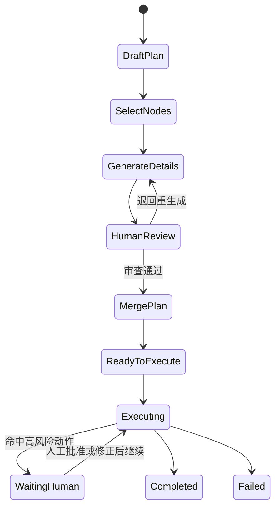

### AI 人机协同规划执行方案

## 七、运行期人工介入机制

即便前期方案已经审查通过，运行期仍应保留人工接管能力，特别是在高风险动作出现时。

### 推荐触发场景

- 即将执行高风险工具：
  - `write_file`
  - `execute_command`
  - `delete_file`
- AI 连续多轮未收敛
- 工具调用参数明显可疑
- 工具执行失败
- 用户手动点击“暂停并接管”

### 推荐状态机

### 运行期建议支持的动作

- **批准继续执行**
- **编辑参数后执行**
- **插入纠偏指令并重规划**
- **跳过当前步骤**
- **人工填写工具结果继续**
- **终止本次执行**

---
